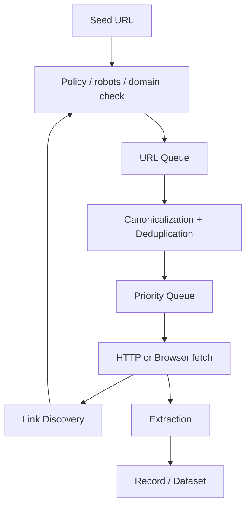

# 06 — Extraction, Schema ve Crawler Motoru

**Sürüm:** 0.1.0  
**Durum:** Tasarım  
**Kapsam:** CSS/XPath, JSONPath, AI extraction, schema validation, kalite ve crawl

## 1. Extraction katmanının amacı

Extraction katmanı, HTTP response, browser DOM veya yakalanmış API payload'ından kullanıcı tarafından tanımlanan yapılandırılmış kayıtları üretir. Ham içeriğin alınmış olması başarılı veri üretildiği anlamına gelmez; extraction ve validation adımları tamamlanmadan kayıt dataset'in yayınlanabilir çıktısı sayılmaz.

Extraction planı schema'dan bağımsız bir yürütme tanımıdır. Aynı schema için farklı hedeflerde farklı selector, JSONPath veya AI prompt stratejileri bulunabilir. Planlar sürümlenmeli; bir job hangi plan sürümüyle çalıştıysa attempt metadata'sına kaydedilmelidir.

## 2. Extraction modları

### 2.1 CSS/XPath extraction

CSS/XPath modu deterministik, hızlı ve tercih edilen yöntemdir. Her alan için selector, kaynak türü, değer okuma yöntemi ve normalize adımları tanımlanabilir.

```json
{
  "mode": "css_xpath",
  "fields": {
    "product_name": {
      "selector": ".product-title",
      "selectorType": "css",
      "value": "text",
      "required": true
    },
    "price": {
      "selector": ".price",
      "selectorType": "css",
      "value": "text",
      "transform": ["trim", "parse_money"]
    },
    "product_image": {
      "selector": ".product-image",
      "selectorType": "css",
      "value": "attribute:src"
    }
  }
}
```

Selector bulunamazsa alan `missing` olarak işaretlenmelidir. Selector'ın bulunmaması her zaman task hatası değildir; alanın `required` niteliği ve kalite politikasına göre kayıt invalid veya düşük kaliteli olabilir.

### 2.2 JSON/API extraction

HTTP Worker tarafından alınan JSON response veya Browser Worker network interception sonucu JSONPath ile okunabilir. JSON extraction için content-type, parse başarısı ve response schema'sı ayrıca doğrulanmalıdır.

```json
{
  "mode": "json",
  "rootPath": "$.products[*]",
  "fields": {
    "product_name": "$.name",
    "brand": "$.brand.name",
    "price": "$.offers.price",
    "currency": "$.offers.priceCurrency",
    "availability": "$.offers.inStock"
  }
}
```

API payload'ı içinde pagination veya next-page bilgisi varsa crawler task'ına yeni URL üretme kararı ayrı bir policy ile verilmelidir. Kullanıcı tarafından izin verilmemiş endpoint'ler veya host'lar izlenmemelidir.

### 2.3 AI extraction

AI extraction, selector veya JSONPath ile güvenilir biçimde çıkarılamayan içeriklerde kontrollü fallback olarak kullanılabilir. Akış şöyledir:

```mermaid
flowchart LR
    RAW[HTML / DOM / JSON] --> CLEAN[Cleaner]
    CLEAN --> PROMPT[Versioned extraction prompt]
    PROMPT --> LLM[LLM Provider Adapter]
    LLM --> JSON[Structured JSON candidate]
    JSON --> PARSE[Strict JSON parse]
    PARSE --> SCHEMA[Schema validator]
    SCHEMA --> QUALITY[Quality score]
    QUALITY --> DATASET[Dataset staging]
```



AI extraction için modelden serbest metin yerine yapılandırılmış çıktı istenmelidir. Model adı, provider, prompt sürümü, token kullanımı, gecikme ve model confidence metadata'sı kaydedilmelidir. Ham sayfa içeriği prompt'a aktarılmadan önce script, style, gereksiz navigasyon ve büyük tekrarlar temizlenmelidir.

AI modeline credential, session cookie, authorization header, özel tenant verisi veya gereksiz kişisel veri gönderilmemelidir. Hedef içeriği prompt injection benzeri talimatlar içeriyorsa bu metin veri olarak ele alınmalı; sistem talimatı veya kullanıcı schema'sının yerine geçmemelidir.

## 3. Schema sözleşmesi

MVP schema tanımı, JSON Schema benzeri açık bir alan sözleşmesi kullanır:

```json
{
  "name": "product",
  "version": 1,
  "additionalProperties": false,
  "fields": {
    "product_name": {
      "type": "string",
      "required": true,
      "minLength": 1
    },
    "brand": {
      "type": "string",
      "required": false
    },
    "price": {
      "type": "number",
      "required": true,
      "minimum": 0
    },
    "currency": {
      "type": "string",
      "required": true,
      "pattern": "^[A-Z]{3}$"
    },
    "availability": {
      "type": "boolean",
      "required": false
    },
    "rating": {
      "type": "number",
      "required": false,
      "minimum": 0,
      "maximum": 5
    }
  }
}
```

Schema validator en az şu kontrolleri yapmalıdır: zorunlu alanların varlığı, tip uygunluğu, minimum/maximum, string uzunluğu ve pattern, array öğelerinin tipleri, nullability, bilinmeyen alan policy'si ve normalize edilmiş değerin kaynağa bağlanabilirliği.

## 4. Normalize kuralları

Extraction ile validation arasında normalize katmanı bulunmalıdır. Normalize işlemleri idempotent olmalı ve orijinal değeri silmemelidir. Her dönüşüm için `rawValue`, `normalizedValue`, `transformName` ve hata nedeni gerektiğinde metadata olarak tutulabilir.

| Dönüşüm | Örnek | Hata davranışı |
|---|---|---|
| `trim` | Baş/son boşlukları temizleme | Değer boşalırsa missing |
| `parse_number` | `1.234,56` → sayısal değer | Locale bilinmiyorsa invalid |
| `parse_money` | Fiyat metninden amount/currency ayırma | Kanıt yoksa düşük confidence |
| `parse_boolean` | Stok metnini boolean'a çevirme | Tanımsız ifade invalid |
| `normalize_url` | Relative URL'i absolute yapma | Host policy ile doğrula |
| `normalize_text` | Tekrarlı whitespace azaltma | Orijinal değer korunur |

## 5. Kalite puanı

Kalite puanı, yalnızca alanların bulunmasına değil, alan ağırlıklarına ve doğrulama sonuçlarına dayanmalıdır. Varsayılan formül aşağıdaki gibi uygulanabilir:

```text
qualityScore = 100 × Σ(fieldWeight × fieldScore) / Σ(fieldWeight)
```

`fieldScore` değeri; geçerli ve kaynakla eşleşen alan için `1`, eksik opsiyonel alan için `0.5`, geçersiz veya kaynağı belirsiz alan için `0`, doğrulanamayan zorunlu alan için `0` olabilir. Ürün, alan ağırlıklarını schema seviyesinde değiştirebilir.

```text
product_name     ✓  weight 2.0
brand            ✓  weight 1.0
price            ✓  weight 2.0
currency         ✓  weight 1.0
availability     ✗  weight 1.0

Quality: 85.7%
```

Job kabul politikası `minimumQualityScore`, `minimumValidRecords`, `allowPartialResults` ve `maxInvalidRatio` alanlarıyla ifade edilmelidir. Kalite puanı kararın gerekçesini de taşımalı; dashboard yalnızca tek bir yüzde göstermemelidir.

## 6. Extraction hata taxonomy'si

| Kod | Açıklama | Retry varsayılanı |
|---|---|---:|
| `PARSER_ERROR` | HTML/JSON parse edilemedi | Hayır |
| `EXTRACTION_EMPTY` | Beklenen hiçbir kayıt bulunamadı | Sınırlı |
| `SELECTOR_NOT_FOUND` | Selector eşleşmedi | Hayır |
| `JSON_PATH_NOT_FOUND` | JSONPath eşleşmedi | Hayır |
| `NORMALIZATION_ERROR` | Değer dönüştürülemedi | Hayır |
| `SCHEMA_INVALID` | Kayıt schema'ya uymuyor | Hayır |
| `QUALITY_BELOW_THRESHOLD` | Sonuç kabul eşiğinin altında | Hayır |
| `LLM_INVALID_OUTPUT` | Yapılandırılmış model çıktısı parse edilemedi | Sınırlı |
| `LLM_UNAVAILABLE` | LLM provider kullanılamıyor | Evet, bütçeli |
| `ARTIFACT_WRITE_FAILED` | Ham içerik veya çıktı yazılamadı | Evet, bütçeli |

## 7. Crawler mimarisi

Crawler, tek URL extraction'dan farklı olarak URL frontier ve keşif durumunu yönetir:



### Crawler kuralları

| Kural | Tanım |
|---|---|
| Seed | Kullanıcı tarafından verilen başlangıç URL'leri |
| Sitemap | Policy izin veriyorsa sitemap kaynaklarından URL üretimi |
| robots/policy | Crawl öncesi ve gerektiğinde host değişiminde kontrol |
| Pagination | Tanımlı next link veya kullanıcı kuralı ile ilerleme |
| Recursive crawl | `maxDepth` ve `maxPages` sınırı olmadan çalışmaz |
| Domain restriction | Varsayılan olarak seed host ile sınırlı |
| Allowlist/denylist | URL pattern'leri için açık filtre |
| Canonicalization | Fragment, izleme parametreleri ve slash kuralları normalize edilir |
| Deduplication | Canonical URL ve içerik checksum'u birlikte kullanılabilir |
| Rate limit | Host, tenant ve worker kapasitesine göre uygulanır |

URL frontier Redis'te hızlı kuyruk, PostgreSQL'de kalıcı crawl state olarak tutulabilir. Aynı URL için birden fazla task üretimini önlemek için canonical URL üzerinde tenant ve job kapsamlı unique key kullanılmalıdır.

## 8. Güvenli crawl sınırları

Crawler; private network, metadata endpoint, sınırsız redirect, sınırsız response boyutu, sonsuz pagination ve kullanıcı policy'si dışındaki host'ları engellemelidir. URL içinde credential, token veya hassas query parametresi loglanmamalıdır. Crawl artifact'lerinin retention süresi job/tenant policy'si ile uyumlu olmalıdır.

## References

[1]: ../source/pasted_content.txt "Kullanıcı tarafından sağlanan sistem taslağı"
