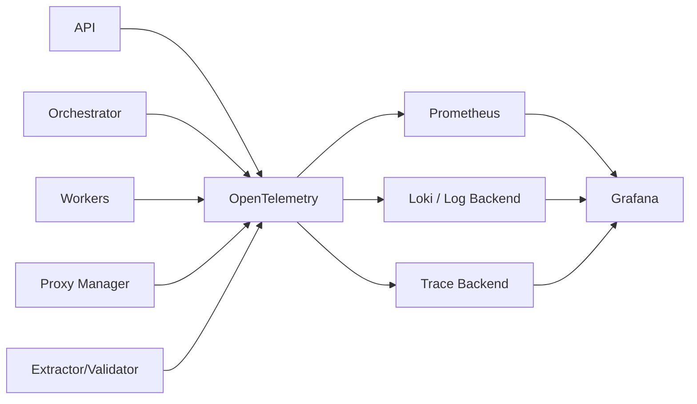

# 08 — Gözlemlenebilirlik ve Maliyet Zekâsı

**Sürüm:** 0.1.0  
**Durum:** Tasarım  
**Kapsam:** Log, metrik, trace, kalite sinyalleri, maliyet hesaplama ve dashboard

## 1. Hedef

Gözlemlenebilirlik, tek bir isteğin API'den kuyruğa, worker'a, proxy'ye, hedefe, parser/extractor'a ve dataset'e kadar izlenebilmesini sağlar. Maliyet zekâsı aynı korelasyon zinciri üzerinden her job'ın kaynak tüketimini hesaplar. Amaç yalnızca teknik hata bulmak değil; hangi hedefin, stratejinin, provider'ın veya schema'nın hangi maliyetle ne kalitede sonuç ürettiğini görünür kılmaktır.

## 2. Telemetri akışı



MVP'de OpenTelemetry instrumentation kütüphaneler ve ortak `packages/observability` modülü üzerinden uygulanmalıdır. Servisler kendi trace ve log formatını üretmemeli; ortak logger, metric helper ve correlation middleware kullanmalıdır.

## 3. Correlation ve trace standardı

Her API isteği `requestId` ve `traceId` üretir veya mevcut değerleri devralır. Job ve task oluşturulduğunda bu bağlam kaybolmamalıdır. Queue mesajı `traceId`, `spanId`, `jobId`, `taskId`, `attemptId`, `tenantId` ve `messageId` taşır.

```text
API request
  └── job.create
      └── task.dispatch
          └── worker.attempt
              ├── proxy.acquire
              ├── target.request
              ├── parse
              ├── extract
              ├── validate
              └── dataset.persist
```

URL query değeri, cookie, authorization header, credential, response body ve kişisel veri trace attribute olarak yazılmamalıdır. Target host, HTTP method, status code, response size ve latency gibi maskeleme sonrası alanlar kullanılabilir.

## 4. Yapılandırılmış log standardı

Her log satırı makine tarafından parse edilebilir JSON olmalıdır.

```json
{
  "timestamp": "2026-08-26T10:00:01.123Z",
  "level": "INFO",
  "service": "worker-http",
  "version": "0.1.0",
  "message": "HTTP attempt completed",
  "requestId": "req_01J...",
  "traceId": "trace_01J...",
  "tenantId": "tenant_01J...",
  "jobId": "job_01J...",
  "taskId": "task_01J...",
  "attemptId": "attempt_01J...",
  "targetHost": "example.com",
  "statusCode": 200,
  "durationMs": 842,
  "responseBytes": 48320
}
```

| Seviye | Kullanım |
|---|---|
| `DEBUG` | Geliştirme ayrıntısı; production'da sınırlı |
| `INFO` | Job/task transition, başarılı attempt, worker yaşam olayı |
| `WARN` | Retry, rate limit, düşük kalite, provider degradation |
| `ERROR` | Task/attempt hatası, dependency failure, veri kaybı riski |
| `FATAL` | Servisin çalışmasını sürdüremediği durum |

Log mesajı eylem ve sonucu açıkça ifade etmelidir. Aynı exception'ı her katmanda stack trace ile çoğaltmak yerine root cause ve correlation link'i korunmalıdır.

## 5. Temel metrikler

### Platform metrikleri

| Metrik | Tür | Boyutlar |
|---|---|---|
| `api_requests_total` | Counter | method, route, status |
| `api_request_duration_ms` | Histogram | route, status |
| `queue_depth` | Gauge | queue, task_type |
| `queue_wait_duration_ms` | Histogram | queue, task_type |
| `jobs_total` | Counter | status, project |
| `job_duration_ms` | Histogram | project, strategy |
| `tasks_total` | Counter | task_type, status |
| `worker_active_tasks` | Gauge | worker_type, worker_id |
| `worker_heartbeat_age_seconds` | Gauge | worker_type |

### Erişim metrikleri

| Metrik | Tür | Boyutlar |
|---|---|---|
| `target_requests_total` | Counter | host, method, mode, status_class |
| `target_request_duration_ms` | Histogram | host, mode |
| `target_response_bytes` | Histogram | host, content_type |
| `proxy_requests_total` | Counter | provider, proxy_class, result |
| `proxy_success_rate` | Gauge/derived | provider, host |
| `rate_limit_events_total` | Counter | host, provider |
| `browser_session_seconds` | Counter | host, browser_version |

### Extraction metrikleri

| Metrik | Tür | Boyutlar |
|---|---|---|
| `records_extracted_total` | Counter | schema, mode |
| `records_valid_total` | Counter | schema |
| `records_invalid_total` | Counter | schema, error_code |
| `extraction_quality_score` | Histogram | schema, target |
| `selector_miss_total` | Counter | schema, field |
| `llm_tokens_total` | Counter | provider, model, direction |
| `llm_extraction_failures_total` | Counter | provider, model, error_code |

Metrik label'larında yüksek cardinality oluşturan `jobId`, tam URL, recordId veya serbest metin kullanılmamalıdır. Bu alanlar log ve trace'te tutulabilir; metriklerde proje, host, schema ve task type gibi kontrollü boyutlar kullanılmalıdır.

## 6. Alarm önerileri

| Alarm | Başlangıç koşulu | Aksiyon |
|---|---|---|
| Queue backlog | Kuyruk derinliği ve bekleme süresi birlikte yükseliyor | Worker kapasitesi ve dependency kontrolü |
| Worker heartbeat | Heartbeat yaşı eşik üstünde | Worker drain/restart ve task lease kontrolü |
| Provider degradation | Başarı oranı düşüyor veya timeout artıyor | Provider health, kota ve policy kontrolü |
| Target rate limit | 429/rate-limit yoğunluğu artıyor | Oranı düşür, retry bütçesini koru |
| Extraction quality drop | Aynı schema/target kalite trendi düşüyor | Selector/schema drift incelemesi |
| Storage failure | Artifact veya dataset yazımı başarısız | Object storage ve quota kontrolü |
| Cost spike | Job başına maliyet baseline'ı aşılır | Browser/LLM/retry dağılımını incele |
| Error spike | Terminal hata oranı artar | Error taxonomy kırılımına göre triage |

## 7. Maliyet modeli

Her tüketim, job veya attempt ile ilişkilendirilen `usage_event` olarak kaydedilir. Maliyet; provider faturasının dışarıdan girilmesi veya konfigürasyondaki birim fiyatla çarpılmasıyla hesaplanabilir. Gerçek fatura ile tahmini maliyet ayrıştırılmalıdır.

```text
jobCost = requestCost
        + proxyRequestCost
        + proxyBandwidthCost
        + browserTimeCost
        + llmInputTokenCost
        + llmOutputTokenCost
        + storageCost
        + computeCost
        + retryCost
```

Örnek maliyet özeti:

| Kalem | Miktar | Birim | Tutar |
|---|---:|---:|---:|
| HTTP request | 12.483 | request | provider tarifesine göre |
| Browser time | 2,4 | saat | browser birim fiyatı |
| Proxy | — | request/GB | provider tarifesine göre |
| LLM | — | input/output token | model tarifesine göre |
| Compute | — | worker-saniye | iç maliyet tablosu |
| Storage | — | GB-gün | object storage tarifesine göre |
| Retry overhead | 842 | attempt | ilgili kaynaklara dağıtılır |

Her `usage_event` aşağıdaki alanları taşımalıdır:

```json
{
  "id": "usage_01J...",
  "tenantId": "tenant_01J...",
  "jobId": "job_01J...",
  "attemptId": "attempt_01J...",
  "category": "llm_output_tokens",
  "quantity": 1200,
  "unit": "token",
  "unitCost": 0.00001,
  "estimatedCost": 0.012,
  "currency": "USD",
  "source": "provider_usage",
  "occurredAt": "2026-08-26T10:00:02Z"
}
```

Maliyet hesaplaması append-only kullanım olaylarından türetilmeli; job özetleri yeniden hesaplanabilir olmalıdır. `costPerRecord`, valid/invalid kayıt ayrımıyla birlikte gösterilmelidir. Tek başına düşük maliyet, düşük kaliteli sonucu başarılı saydırmamalıdır.

## 8. Dashboard KPI'ları

Control Center Overview ekranında en az job sayısı, başarı/başarısızlık oranı, aktif worker, queue wait, requests/minute, proxy health, extraction quality, son maliyet ve cost/record gösterilmelidir. Her KPI'nın zaman aralığı ve tenant/project filtresi görünür olmalıdır.

## 9. Operasyonel SLO taslağı

MVP'de kesin SLO değerleri trafik gözlemlendikten sonra belirlenmelidir. Başlangıçta ölçülecek hedefler; API kabul gecikmesi, job queue wait, worker availability, başarılı task yüzdesi, dataset publish süresi, telemetry completeness ve cost attribution completeness'tir. SLO değeri belirlenirken provider ve hedef kaynak başarısızlıkları platform içi hata ile karıştırılmamalıdır.

## References

[1]: ../source/pasted_content.txt "Kullanıcı tarafından sağlanan sistem taslağı"
