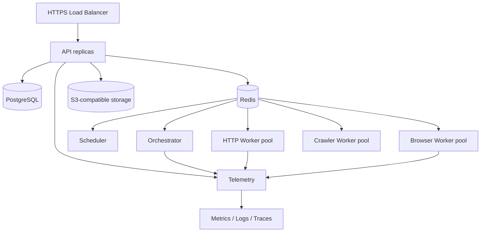

# 09 — Dağıtım ve Operasyon Runbook'u

**Sürüm:** 0.1.0  
**Durum:** Tasarım  
**Kapsam:** Geliştirme, test, production, release, backup, alarm ve olay yönetimi

## 1. Ortamlar

Platform en az `local`, `staging` ve `production` ortamlarına ayrılmalıdır. Ortamlar aynı sözleşmeyi kullanmalı; yalnızca endpoint, credential, kapasite ve retention gibi konfigürasyonlar farklılaşmalıdır.

| Ortam | Amaç | Veri politikası | Dış hedef erişimi |
|---|---|---|---|
| `local` | Geliştirici deneyimi ve unit/integration test | Sentetik veya açık test verisi | Mock/allowlist hedefler |
| `staging` | Release adayı ve uçtan uca test | Anonimleştirilmiş test verisi | Sınırlı test hedefleri |
| `production` | Gerçek tenant işlerinin yürütülmesi | Tenant policy ve retention | Yetkilendirilmiş hedefler |

Production credential'ları local veya staging'e kopyalanmamalıdır. Her ortamın queue, database ve object storage kaynağı ayrı tutulmalı; yanlışlıkla production job'ı staging worker'ına düşürmeyecek kimlik ve namespace kontrolleri bulunmalıdır.

## 2. Yerel geliştirme bileşenleri

MVP yerel kurulumu aşağıdaki bileşenleri çalıştırır:

```text
control-center  →  api  →  PostgreSQL
                    ├── Redis/BullMQ
                    ├── scheduler
                    ├── worker-http
                    ├── worker-browser
                    └── S3-compatible storage
```

Önerilen başlangıç adımları:

```bash
pnpm install
pnpm db:migrate
pnpm dev
pnpm test
pnpm lint
pnpm typecheck
```

Komut isimleri repository'de kesinleştirilmelidir. Geliştirici, browser worker'ı çalıştırmadan önce Chromium runtime ve sistem bağımlılıklarının hazır olduğunu doğrulamalıdır. Local ortamda gerçek proxy veya LLM provider yerine mock adapter kullanılabilmelidir.

## 3. Konfigürasyon standardı

Konfigürasyon merkezi bir `packages/config` modülünden okunmalı ve uygulama başlangıcında şema ile doğrulanmalıdır. Uygulama içinde `process.env` çağrıları dağınık tutulmamalıdır.

| Değişken grubu | Örnek alanlar |
|---|---|
| Uygulama | `NODE_ENV`, `SERVICE_NAME`, `LOG_LEVEL` |
| API | `API_PORT`, `API_BASE_URL`, `CORS_ORIGINS` |
| Database | `DATABASE_URL`, pool limitleri, migration mode |
| Queue | `REDIS_URL`, queue prefix, retry defaults |
| Storage | bucket, endpoint, region, credential reference |
| Auth | issuer, audience, session secret reference |
| Provider | provider enabled flags, credential references |
| Policy | default timeout, max response, concurrency, retention |
| Observability | exporter endpoint, sampling, metrics port |

Secret değerleri `.env` dosyasına commit edilmemeli, örnek dosyada yalnızca placeholder kullanılmalıdır. Konfigürasyon hatası uygulama başlamadan anlaşılır bir hata ile süreci durdurmalıdır.

## 4. Dağıtım topolojisi

MVP fiziksel topoloji:



API ve worker'lar stateless tasarlanmalı; session state, queue lease, database veya object storage'da tutulmalıdır. Browser pool process-local optimizasyon olabilir ancak tenant session'ı kalıcı ortak havuza konulmamalıdır.

## 5. Release süreci

Release aşağıdaki kalite kapılarından geçmelidir:

1. Pull request için lint, typecheck, unit test ve migration doğrulaması çalışır.
2. Staging'de HTTP Worker, Browser Worker, extraction, validation, queue retry ve storage yazımı uçtan uca test edilir.
3. Schema ve queue message sürümlerinin geriye dönük uyumu doğrulanır.
4. Deployment öncesi database migration planı ve rollback etkisi incelenir.
5. Worker'lar önce `DRAINING` ile eski task'ları kontrollü biçimde bitirir.
6. API ve worker sürümleri birlikte uyumlu olacak şekilde kademeli yayımlanır.
7. Release sonrası queue, error rate, quality score, provider health ve cost attribution izlenir.

Database migration'ları geriye dönük uyumlu iki adımlı yapılmalıdır: önce yeni kolon/structure eklenir, uygulama yeni ve eski biçimi okuyabilir; veri dönüşümü tamamlandıktan sonra eski alan kaldırılır. Aynı release içinde geri döndürülemez migration yapılmamalıdır.

## 6. Queue işletimi

Her task type için ayrı queue veya en azından ayrı routing key bulunmalıdır. Browser task'ları HTTP task'larının kaynaklarını tüketmemelidir. Queue worker'larda concurrency config, global tenant quota ve target rate limit birlikte uygulanmalıdır.

Dead-letter queue, retry bütçesi tükenen task'ları tutar. DLQ mesajı silinmeden önce error code, payload checksum, job/task/attempt kimlikleri ve son deneme nedeni incelenmelidir. Hassas payload'lar DLQ içinde raw biçimde tutulmamalı, object storage referansı veya maskeli özet kullanılmalıdır.

## 7. Backup ve geri yükleme

PostgreSQL için düzenli yedek, object storage için versioning/retention ve Redis için iş durumuna uygun kurtarma politikası tanımlanmalıdır. Redis kuyruk altyapısı yeniden oluşturulabilir olsa da henüz tamamlanmamış task'ların kaybı kabul edilebilirlik hedefiyle açıkça kararlaştırılmalıdır.

| Veri | Backup yaklaşımı | Geri yükleme kontrolü |
|---|---|---|
| PostgreSQL | Düzenli snapshot + point-in-time yaklaşımı | Staging restore ve checksum |
| Object storage | Versioning/replication policy | Artifact URI ve checksum doğrulama |
| Redis | AOF/RDB veya yeniden enqueue | Lease ve idempotency kontrolü |
| Konfigürasyon | Şifre içermeyen versioned config | Ortam şeması doğrulama |
| Audit log | Ayrı, korunmuş depolama | Append-only bütünlük kontrolü |

Backup'ın alınmış olması tek başına yeterli değildir. Geri yükleme tatbikatı, beklenen RTO/RPO ve restore sonrası job/dataset tutarlılık kontrolü runbook'a eklenmelidir.

## 8. Olay müdahalesi

Olay sırasında ilk hedef veri kaybını ve kontrolsüz dış trafiği sınırlamaktır. Operatör; gerekli durumda yeni job dispatch'ini durdurur, provider veya target policy'sini daraltır, etkilenen worker'ları `DRAINING` durumuna alır ve son başarılı trace/job noktasıyla kapsamı belirler.

### Yaygın olaylar

| Olay | İlk kontrol | Güvenli müdahale |
|---|---|---|
| Queue büyümesi | Worker heartbeat, DB/Redis latency | Worker kapasitesini artır veya hedef oranını düşür |
| Browser crash loop | Memory, Chromium process, artifact boyutu | Browser concurrency azalt, worker drain/restart |
| Proxy başarısızlığı | Provider health, kota, target host kırılımı | Provider'ı geçici karantinaya al, retry bütçesini koru |
| Quality düşüşü | Selector miss, schema version, target değişikliği | Yeni extraction planı yayınla; eski planı silme |
| Storage yazma hatası | Bucket erişimi, quota, credential | Dataset publish'i durdur; ham sonucu kaybetme |
| Yetkisiz erişim şüphesi | Audit, auth, object URL erişimleri | Token/credential iptal et, erişimi daralt, olay kaydı aç |
| Kontrolsüz maliyet artışı | Browser seconds, LLM tokens, retries | Budget cap ve feature flag ile AI/browser fallback'i sınırla |

Olay kapanışında root cause, etkilenen tenant/job'lar, veri bütünlüğü, maliyet etkisi, alınan önlemler ve kalıcı aksiyonlar ADR veya incident kaydına yazılmalıdır.

## 9. Health ve readiness

`/health/live` process'in ayakta olduğunu; `/health/ready` ise servis bağımlılıklarının task almaya uygun olduğunu belirtir. Worker readiness; queue bağlantısı, konfigürasyon, browser runtime ve storage erişimi gibi gerekli kontrolleri içermelidir. Health endpoint'leri dış hedefe gereksiz istek atmamalıdır.

## 10. Geri dönüş ve feature flag'ler

Riskli özellikler feature flag ile açılmalıdır: browser fallback, AI extraction, yeni provider, yeni crawler stratejisi, webhook teslimi ve maliyet limitleri. Bir provider veya strategy başarısız olduğunda tüm platform release'ini geri almak yerine ilgili flag kapatılabilmelidir.

## References

[1]: ../source/pasted_content.txt "Kullanıcı tarafından sağlanan sistem taslağı"
