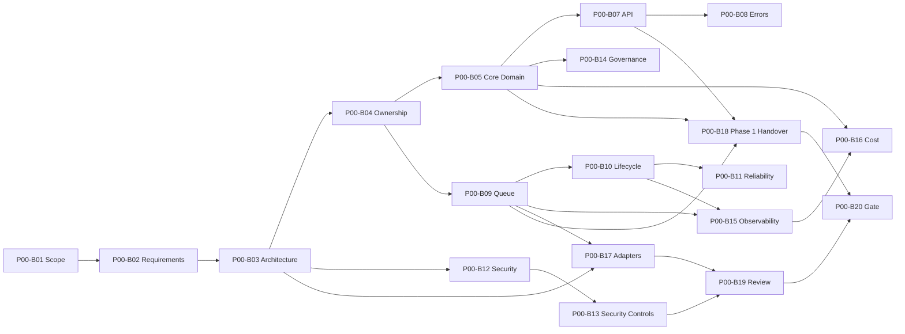

# Backend Phase 0 — M0 Task Board

**Program:** Scraping Platform  
**Kapsam:** Yalnızca backend  
**Milestone:** M0 — Architecture Baseline  
**Sürüm:** 1.0.0  
**Başlangıç durumu:** Not Started  
**Yazar:** Manus AI

## 1. Kullanım amacı

Bu board, Phase 0 içindeki backend task'larının yürütülmesi ve M0 gate'ine hazırlanması için kullanılır. Phase 0'da üretim kodu yazılmaz; teknik karar, sözleşme, model, risk, kalite ve handover çıktıları hazırlanır. Task'lar `Not Started → In Progress → In Review → Accepted` durumlarıyla ilerletilir.

## 2. Task listesi

| ID | İş paketi | Task | Owner | Efor (pd) | Bağımlılık | Çıktı | Kabul kriteri | Durum |
|---|---|---|---|---:|---|---|---|---|
| P00-B01 | Scope | Backend kapsamı, non-goals ve M0 sınırını onayla | Product Owner | 1 | — | Scope baseline | Frontend, mobil ve implementasyon dışı maddeler yazılıdır | Accepted |
| P00-B02 | Requirements | Backend fonksiyonel gereksinimlerini ve quality attribute'larını çıkar | Solution Architect | 3 | P00-B01 | Requirements register | Her gereksinimin önceliği, kaynağı ve kabul kriteri vardır | Accepted |
| P00-B03 | Architecture | Backend context/container mimarisini tasarla | Solution Architect | 3 | P00-B02 | Context/container diagram | API, orchestrator, scheduler, worker, queue, DB, storage, proxy ve telemetry sınırları gösterilir | Accepted |
| P00-B04 | Architecture | Servis sorumlulukları ve veri sahipliğini tanımla | Engineering Manager | 2 | P00-B03 | Ownership matrix | Her veri ve kararın tekil sahibi ile tüketicileri bellidir | Accepted |
| P00-B05 | Domain | Tenant, Project, Target, Schema, Job, Run, Task ve Attempt modelini kesinleştir | Backend Lead | 4 | P00-B04 | Domain model + invariants | İlişkiler, tenant scope, immutable snapshot ve lifecycle invariant'ları tanımlıdır | Accepted |
| P00-B06 | Domain | Worker, Browser, Session, Proxy, Provider, Credential ve Artifact modelini tanımla | Backend Lead | 3 | P00-B05 | Extended domain model | Worker/lease/session/credential/artifact ownership ve retention ilişkileri yazılıdır | Accepted |
| P00-B07 | API | REST resource ve command sözleşmesini tasarla | Backend Lead | 4 | P00-B05 | API contract | `/api/v1`, CRUD, job command, response envelope ve pagination tanımlıdır | Accepted |
| P00-B08 | API | Error taxonomy, HTTP mapping ve idempotency standardını tanımla | Backend Lead | 2 | P00-B07 | Error/idempotency contract | Hata kodu, retryable bilgisi, requestId ve conflict davranışı açıklanır | Accepted |
| P00-B09 | Queue | Queue topology, message envelope ve routing sözleşmesini tasarla | Backend Lead | 4 | P00-B04 | Queue contract | Command/result/event queue'ları, schemaVersion, tenant context ve correlation alanları tanımlıdır | Accepted |
| P00-B10 | Reliability | Job, Task ve Attempt durum makinelerini kesinleştir | SRE/Platform Lead | 3 | P00-B09 | Lifecycle model | Geçerli geçişler, terminal durumlar, lease, heartbeat ve retry boundary yazılıdır | Accepted |
| P00-B11 | Reliability | Retry, backoff, DLQ, cancellation ve reconciliation policy'sini tasarla | SRE/Platform Lead | 3 | P00-B10 | Reliability policy | Retryable/terminal hatalar, budget, poison message ve recovery akışı tanımlıdır | Accepted |
| P00-B12 | Security | Threat boundary, RBAC ve tenant isolation modelini tasarla | Security Lead | 4 | P00-B03 | Security baseline | Rol matrisi, tenant scope, resource authorization ve negative test listesi vardır | Accepted |
| P00-B13 | Security | Secret, credential, SSRF, egress, webhook ve worker isolation kararlarını yaz | Security Lead | 4 | P00-B12 | Security control matrix | Raw secret/log redaction, private IP/port/redirect ve worker limit kuralları bellidir | Accepted |
| P00-B14 | Data Governance | Retention, deletion, audit ve dataset lineage baseline'ını tanımla | Compliance/Legal | 3 | P00-B05, P00-B13 | Data governance matrix | Veri sınıfları, silme kanıtı, audit kapsamı ve lineage alanları listelenmiştir | Accepted |
| P00-B15 | Observability | Trace, log, metric, correlation ve cardinality standardını tasarla | SRE/Platform Lead | 3 | P00-B09, P00-B10 | Observability catalog | request/trace/job/task/attempt alanları ve secret redaction kuralları bellidir | Accepted |
| P00-B16 | Cost | Usage event, cost category ve cost attribution modelini tanımla | FinOps/Operations | 2 | P00-B05, P00-B15 | Cost baseline | HTTP, browser, proxy, LLM, storage, compute ve retry event'leri job'a bağlanır | Accepted |
| P00-B17 | Adapter | ProxyProvider, LLMProvider ve Storage adapter contract'larını tanımla | Solution Architect | 3 | P00-B03, P00-B09 | Adapter interfaces | Provider-specific detaylar core service'e sızmadan normalize edilir | Accepted |
| P00-B18 | Handover | Phase 1 Core Platform backend başlangıç backlog'unu ve dependency'leri çıkar | Engineering Manager | 3 | P00-B05, P00-B07, P00-B09 | Phase 1 handover | Monorepo, config, migration, queue, API, orchestrator ve storage task'ları sıralıdır | Accepted |
| P00-B19 | Review | Architecture review, security review ve açık karar toplantısını yürüt | Solution Architect | 2 | P00-B12, P00-B13, P00-B17 | Review minutes + ADR | Kritik kararlar, itirazlar ve sahipleri kayıtlıdır | Accepted |
| P00-B20 | Gate | M0 Architecture Baseline sign-off ve Phase 1 giriş kararı | Engineering Manager | 1 | P00-B18, P00-B19 | Signed gate record | Tüm M0 artefact'leri kabul edilmiş, blocker risk kalmamış veya risk kabulü imzalanmıştır | In Review |

## 3. Bağımlılık akışı

## 4. M0 çalışma sırası

| Sıra | Çalışma paketi | Sonuç |
|---:|---|---|
| 1 | Scope ve gereksinim | Backend sınırı ve başarı ölçütü |
| 2 | Architecture ve ownership | Servis/data sahibi sınırları |
| 3 | Domain | Çekirdek entity ve invariant'lar |
| 4 | API ve queue | Senkron/asenkron sözleşmeler |
| 5 | Lifecycle/reliability | Durum, retry, lease ve recovery |
| 6 | Security/governance | Tenant, secret, SSRF, retention ve audit |
| 7 | Observability/cost/adapters | Ölçüm ve dış servis abstraction'ı |
| 8 | Handover/review/gate | Phase 1'e hazır baseline |

## 5. M0 exit criteria

M0 ancak aşağıdaki koşulların tamamı sağlandığında `Accepted` olur:

1. Backend scope ve non-goals Product Owner tarafından onaylanmıştır.
2. Context/container diagram ve service ownership matrix Architecture Review'dan geçmiştir.
3. Domain modelde tenant, job, task, attempt, dataset ve artifact lineage tanımlıdır.
4. REST ve queue sözleşmeleri versioning, idempotency, error ve correlation alanlarını içerir.
5. Lifecycle modelinde retry, cancellation, lease, heartbeat, DLQ ve reconciliation davranışı tanımlıdır.
6. Security baseline; RBAC, tenant isolation, secret, SSRF/egress, worker isolation ve audit kontrollerini kapsar.
7. Retention ve cost event modeli Phase 1 implementation task'larına dönüştürülebilir durumdadır.
8. Phase 1 Core Platform handover backlog'u dependency ve acceptance criteria ile hazırdır.
9. Açık kararlar sahip ve karar tarihi ile kayıtlıdır.
10. Architecture, Engineering, Product, Security ve SRE sign-off'ları alınmıştır.

## 6. Definition of Ready

Task başlamadan önce amaç, çıktı, owner, accountable rol, dependency, reviewer, kabul kriteri ve ilgili risk tanımlanmış olmalıdır. Bir task dış provider veya security boundary etkiliyorsa ilgili uzman `Consulted` olarak atanır.

## 7. Definition of Accepted

Task; çıktı dokümanı veya karar kaydı tamamlandığında, kabul kriteri kanıtlandığında, çelişkili sözleşme kalmadığında, ilgili ADR/riske bağlandığında ve owner/accountable review'ünden geçtiğinde `Accepted` yapılır.

## 8. Açık karar kaydı

| Karar | Varsayılan | Sahip | Hedef tarih | Durum |
|---|---|---|---|---|
| İlk Auth provider | Provider-agnostic interface; seçim Phase 1 kickoff'ta | EM + SEC | Phase 1 başı | Open |
| Storage sağlayıcısı | S3-compatible; ortam bazında seçim | SRE | Phase 1 storage task | Open |
| Outbox uygulaması | PostgreSQL outbox veya eşdeğer güvenilir publish | BE + SRE | Phase 1 queue task | Open |
| OpenAPI source-of-truth | API repo içinde versioned sözleşme | BE | Phase 1 API task | Open |
| İlk gerçek proxy provider | Uyum, sözleşme ve maliyet incelemesi sonrası | PO + SRE + COMP | Phase 4 başı | Open |
| Retention değerleri | Tenant/contract bazında sayısallaştırma | COMP + PO | Phase 15 öncesi | Open |

## References

[1]: ../../source/pasted_content.txt "Kullanıcı tarafından sağlanan sistem taslağı"
[2]: ../12-corporate-roadmap.md "Kurumsal roadmap ve delivery planı"
[3]: ../13-task-register.md "Faz ve task register'ı"
[4]: ../01-architecture.md "Platform mimarisi"
[5]: ../03-api-contract.md "API sözleşmesi"
[6]: ../04-lifecycles.md "Yaşam döngüleri"
[7]: ../07-security-rbac.md "Güvenlik ve RBAC"
[8]: ../08-observability-cost.md "Gözlemlenebilirlik ve maliyet"
