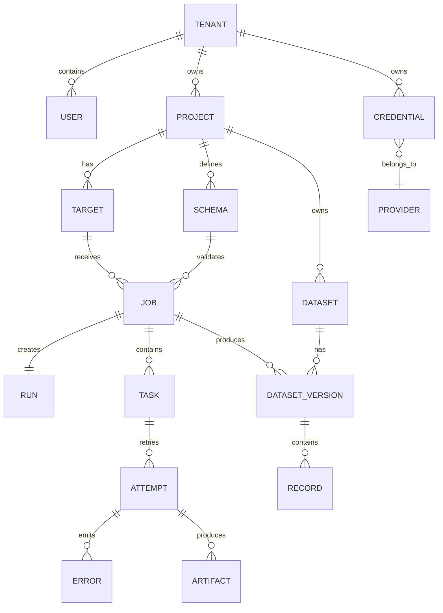

# Backend Phase 0 — P00-B05 Core Domain Model

**Program:** Scraping Platform  
**Kapsam:** Yalnızca backend  
**Faz:** Phase 0 — Architecture & Specification  
**Task:** P00-B05 — Çekirdek domain modelini kesinleştir  
**Sürüm:** 1.0.0  
**Durum:** In Progress  
**Bağımlılık:** P00-B04 — Accepted  
**Owner:** Backend Lead

## 1. Modelleme amacı

Bu belge, platformun çekirdek backend domain modelini ve veri bütünlüğü kurallarını tanımlar. Model, kullanıcı niyeti ile worker yürütmesi arasındaki ayrımı korur: Project ve Target kullanıcı çalışma alanını, Schema beklenen veri sözleşmesini, Job/Run/Task/Attempt yürütme geçmişini, Dataset/Record ise doğrulanmış çıktıyı temsil eder.

Bu aşamada fiziksel migration kodu yazılmaz. Alan isimleri, ilişkiler, unique/index gereksinimleri, aggregate sınırları ve transaction kuralları Phase 1 database task'ının doğrudan girdisidir.

## 2. Domain aggregate'leri

| Aggregate | Root | İçerdiği varlıklar | Transaction sınırı | Owner |
|---|---|---|---|---|
| Tenant | Tenant | User, API key reference, tenant policy | Tenant identity/policy değişiklikleri | Auth/API |
| Project | Project | Target, Schema, Dataset reference | Project kaynak yönetimi | API |
| Execution | Job/Run | Task, Attempt, Error, strategy snapshot | Lifecycle ve result commit | Orchestrator |
| Access | Target/AccessPlan | Proxy lease reference, session reference, policy decision | Erişim planı ve lease sonucu | Policy/Proxy Manager |
| Data Product | Dataset | DatasetVersion, Record, quality summary | Staging → publish | Dataset/Validator |
| Governance | Audit event | AuditLog, UsageEvent, retention marker | Append-only event | Audit/Cost |

Aggregate dışında bulunan bir entity, başka aggregate'in iç durumunu doğrudan güncellemez. Cross-aggregate iletişim command/event ile yapılır.

## 3. İlişki modeli

## 4. Entity sözlüğü ve alanlar

### 4.1 Tenant

Tenant, veri, kullanıcı, maliyet, policy ve erişim sınırının köküdür.

| Alan | Tip | Kural |
|---|---|---|
| `id` | opaque UUID | Immutable, primary key |
| `name` | string | Tenant scope içinde benzersiz |
| `status` | enum | `ACTIVE`, `SUSPENDED`, `DELETED` |
| `policy_json` | JSON | Default timeout, rate, retention ve budget policy |
| `created_at` | timestamp | UTC |
| `updated_at` | timestamp | Optimistic update için |
| `deleted_at` | timestamp/null | Soft delete veya retention silme |

### 4.2 Project

Project, aynı ürün veya kullanım amacıyla ilişkili Target, Schema ve Dataset kaynaklarının çalışma alanıdır.

| Alan | Tip | Kural |
|---|---|---|
| `id` | opaque UUID | Primary key |
| `tenant_id` | UUID | Tenant foreign key; tüm sorgularda scope |
| `name` | string | `(tenant_id, name)` benzersiz |
| `description` | text/null | Kullanıcı açıklaması |
| `status` | enum | `ACTIVE`, `ARCHIVED`, `DELETED` |
| `default_policy_json` | JSON | Project seviyesinde policy override |
| `created_by` | UUID | Audit actor reference |
| `created_at`, `updated_at` | timestamp | UTC |

### 4.3 Target

Target, erişim yapılacak URL/host ailesini ve çalışma policy'sini temsil eder. Job oluşturulduğunda Target'ın execution ve policy alanlarının immutable snapshot'ı alınır.

| Alan | Tip | Kural |
|---|---|---|
| `id` | opaque UUID | Primary key |
| `project_id` | UUID | Project foreign key |
| `tenant_id` | UUID | Defense-in-depth scope |
| `name` | string | Project içinde benzersiz |
| `seed_url` | URL | Normalize edilir; credential URL içinde kabul edilmez |
| `host` | string | Normalize edilmiş host |
| `allowed_hosts` | JSON array | Redirect/discovery allowlist |
| `allowed_ports` | JSON array | Varsayılan HTTPS portları; açık policy |
| `execution_policy_json` | JSON | HTTP/browser, timeout, concurrency, response limit |
| `crawl_policy_json` | JSON | Depth, pages, domain, allow/deny pattern |
| `access_policy_json` | JSON | robots/policy, proxy class, geo ve rate |
| `status` | enum | `ACTIVE`, `PAUSED`, `ARCHIVED`, `DELETED` |
| `created_at`, `updated_at` | timestamp | UTC |

### 4.4 Schema

Schema, extraction sonucu beklenen alan ve doğrulama sözleşmesidir. Published schema version immutable'dır.

| Alan | Tip | Kural |
|---|---|---|
| `id` | opaque UUID | Logical schema family root veya version ID |
| `project_id` | UUID | Project foreign key |
| `tenant_id` | UUID | Tenant scope |
| `name` | string | Project içinde logical name |
| `version` | integer | `(project_id, name, version)` benzersiz |
| `definition_json` | JSON | Field type, required, constraints |
| `status` | enum | `DRAFT`, `PUBLISHED`, `DEPRECATED` |
| `created_by` | UUID | Actor reference |
| `created_at` | timestamp | UTC |

Schema definition, `additionalProperties`, type, required, nullable, min/max, pattern ve nested object/array kurallarını ifade edebilir. Job snapshot'ı schema ID ve version'ı birlikte taşır.

### 4.5 Job

Job, kullanıcının veya Scheduler'ın belirli bir Target ve Schema ile yürütme niyetidir. Job configuration oluşturulduktan sonra execution snapshot ile korunur.

| Alan | Tip | Kural |
|---|---|---|
| `id` | opaque UUID | Primary key |
| `tenant_id` | UUID | Tenant scope |
| `project_id` | UUID | Project foreign key |
| `target_id` | UUID | Source target reference |
| `schema_id` | UUID | Validation schema reference |
| `run_id` | UUID | Mantıksal çalıştırma grubu |
| `status` | enum | Lifecycle state machine |
| `trigger_type` | enum | `MANUAL`, `SCHEDULED`, `API`, `RETRY` |
| `input_json` | JSON | URL list, limits ve user input; secret yok |
| `target_snapshot_json` | JSON | Job başlangıç config snapshot'ı |
| `schema_snapshot_json` | JSON | Schema version snapshot'ı |
| `strategy_snapshot_json` | JSON | Mode, fallback, budget ve policy snapshot |
| `progress_json` | JSON | Counts ve stage summary |
| `quality_summary_json` | JSON | Valid/invalid/score summary |
| `cost_summary_json` | JSON | Derived usage summary |
| `created_by` | UUID/null | User veya service actor |
| `created_at`, `started_at`, `finished_at` | timestamp/null | UTC |

Job source target veya schema değiştirilerek yeniden kullanılmaz. Yeni bir çalışma yeni Job üretir; retry aynı Job altında yeni Attempt üretir.

### 4.6 Run

Run, bir Job'ın mantıksal yürütme grubudur. MVP'de bir Job bir Run oluşturur; ileride fan-out veya scheduled grouping için Run genişletilebilir.

| Alan | Tip | Kural |
|---|---|---|
| `id` | opaque UUID | Primary key |
| `tenant_id` | UUID | Tenant scope |
| `job_id` | UUID | Job foreign key |
| `sequence_no` | integer | Job içi sıra |
| `status` | enum | Job ile uyumlu aggregate summary |
| `created_at`, `started_at`, `finished_at` | timestamp/null | UTC |

### 4.7 Task

Task, Orchestrator'ın bir Job içindeki yürütülebilir iş birimidir. Task tipleri `HTTP_FETCH`, `BROWSER_FETCH`, `CRAWL_DISCOVERY`, `EXTRACT`, `VALIDATE`, `PUBLISH` ve `EXPORT` olabilir.

| Alan | Tip | Kural |
|---|---|---|
| `id` | opaque UUID | Primary key |
| `tenant_id` | UUID | Tenant scope |
| `job_id` | UUID | Job foreign key |
| `run_id` | UUID | Run foreign key |
| `parent_task_id` | UUID/null | Crawl/fan-out parent |
| `task_type` | enum | Worker routing için |
| `status` | enum | `PENDING`, `CLAIMED`, `RUNNING`, `SUCCEEDED`, `RETRYABLE_FAILED`, `FAILED`, `CANCELLED` |
| `payload_json` | JSON | Reference/plan; secret ve büyük body yok |
| `dependency_json` | JSON | Predecessor task IDs veya DAG metadata |
| `attempt_count` | integer | Derived/guarded counter |
| `max_attempts` | integer | Job/policy budget ile sınırlı |
| `created_at`, `updated_at` | timestamp | UTC |

### 4.8 Attempt

Attempt, Task'ın tek bir yürütme denemesidir. Attempt geçmişi append-only tutulur.

| Alan | Tip | Kural |
|---|---|---|
| `id` | opaque UUID | Primary key |
| `tenant_id` | UUID | Tenant scope |
| `task_id` | UUID | Task foreign key |
| `attempt_no` | integer | `(task_id, attempt_no)` benzersiz |
| `worker_id` | UUID/null | Worker reference |
| `lease_id` | UUID/null | Lease/fencing reference |
| `status` | enum | `CLAIMED`, `RUNNING`, `SUCCEEDED`, `FAILED`, `TIMEOUT`, `CANCELLED`, `WORKER_LOST` |
| `strategy_json` | JSON | Effective strategy snapshot |
| `access_result_json` | JSON | Status, provider class, policy decision; secret yok |
| `result_ref_json` | JSON | Artifact/result reference |
| `error_code` | string/null | Error taxonomy reference |
| `started_at`, `finished_at` | timestamp/null | UTC |
| `duration_ms` | integer/null | Derived metric |

## 5. Core invariant'lar

| Kod | Invariant | Uygulama kuralı |
|---|---|---|
| INV-001 | Tenant ownership | Her aggregate root ve child record tenant scope taşır. |
| INV-002 | Project consistency | Target, Schema, Dataset ve Job ilişkileri aynı tenant/project sınırındadır. |
| INV-003 | Job snapshot | Job başladıktan sonra target/schema/strategy snapshot değişmez. |
| INV-004 | Immutable schema | Published schema version değiştirilmez; yeni version üretilir. |
| INV-005 | Attempt append-only | Retry yeni attempt'tir; geçmiş attempt güncellenerek gizlenemez. |
| INV-006 | Valid transition | Status yalnızca state machine geçişiyle değişir. |
| INV-007 | Dependency order | Task predecessor tamamlanmadan dependent task dispatch edilmez. |
| INV-008 | Idempotent result | Aynı result message tekrarlandığında record/cost/dataset iki kez yazılmaz. |
| INV-009 | No secret persistence | Secret, cookie ve authorization raw değeri domain payload'a konulmaz. |
| INV-010 | Published lineage | Record, dataset version, schema version, source job ve attempt'e izlenebilir. |
| INV-011 | Explicit partial result | Kısmi result yalnızca policy açıkça izin veriyorsa publish edilir. |
| INV-012 | Soft delete safety | Silme, audit/retention etkisi ve child kayıt politikası değerlendirilmeden fiziksel yapılmaz. |

## 6. Transaction sınırları

### Job oluşturma transaction'ı

Aynı transaction içinde tenant/project consistency kontrolü, Job, Run, ilk Task ve idempotency kaydı oluşturulur. Outbox event'i yazılır. Queue publish transaction dışı ise Job'ın `QUEUED` state'ine geçişi publish kanıtı veya reconcile edilebilir state ile korunur.

### Attempt result transaction'ı

Consumer; message ID, tenant, job, task ve attempt eşleşmesini doğrular. Attempt sonucu bir kez yazılır. Orchestrator geçerli state transition'ı, sonraki task dispatch outbox'ını, progress summary güncellemesini ve ilgili usage/audit event referanslarını atomik veya reconcile edilebilir biçimde kaydeder.

### Dataset publish transaction'ı

Validated batch, DatasetVersion staging alanına yazılır. Quality/publish threshold geçilirse version publish edilir; aksi halde version `ABORTED` veya `PARTIAL` policy durumunda kapanır. Published version daha sonra değiştirilemez.

## 7. Unique ve index baseline'ı

| Tablo | Unique/kısıt | İndeks |
|---|---|---|
| `users` | `(tenant_id, email)` | `tenant_id`, status |
| `projects` | `(tenant_id, name)` | `tenant_id, status` |
| `targets` | `(project_id, name)` | `tenant_id, host`, status |
| `schemas` | `(project_id, name, version)` | `project_id, status` |
| `jobs` | `idempotency_key` tenant scope | `tenant_id, created_at`, `status`, `project_id` |
| `runs` | `(job_id, sequence_no)` | `job_id, status` |
| `tasks` | `(job_id, task_key)` | `job_id, status`, `tenant_id, status` |
| `attempts` | `(task_id, attempt_no)` | `task_id, started_at`, status |
| `dataset_versions` | `(dataset_id, version_no)` | `tenant_id, created_at`, status |
| `records` | `(dataset_version_id, record_key)` | dataset version, source URL hash |
| `artifacts` | `(attempt_id, kind, checksum)` | tenant, retention state |
| `audit_logs` | append-only event ID | `tenant_id, occurred_at`, resource |
| `usage_events` | event ID/idempotency key | `tenant_id, job_id, category, occurred_at` |

İndeks kolonlarının gerçek sorgu planı ile doğrulanması Phase 1 integration/load testlerinde yapılmalıdır. Tam URL, raw payload veya yüksek cardinality serbest metin metrik label'ı veya gereksiz index alanı yapılmamalıdır.

## 8. Soft delete ve retention

Project, Target, Schema, Dataset ve Job metadata'sı için soft delete veya status-based archive kullanılır. Fiziksel silme; child relation, audit, legal hold, artifact ve dataset lineage kontrolünden sonra çalışır. Session state ve secret reference daha kısa retention ile ayrı lifecycle'a sahiptir.

## 9. P00-B05 kabul kriterleri

P00-B05 `Accepted` sayılması için:

1. Core aggregate'ler, root'lar ve transaction sınırları tanımlıdır.
2. Tenant, Project, Target, Schema, Job, Run, Task ve Attempt alanları ve ilişkileri eksiksizdir.
3. Job snapshot, schema immutability, attempt history, lineage ve idempotency invariant'ları yazılıdır.
4. Job create, attempt result ve dataset publish transaction akışları açıklanmıştır.
5. Phase 1 migration için unique/index baseline'ı bulunmaktadır.
6. Soft delete, retention ve fiziksel silme etkileri belirtilmiştir.
7. Domain model, P00-B04 ownership matrisi ile çelişmemektedir.
8. Backend Lead, Solution Architect, Data/Extraction Lead, SRE ve Security review'ü tamamlanmıştır.

## References

[1]: ../../source/pasted_content.txt "Kullanıcı tarafından sağlanan sistem taslağı"
[2]: ../02-domain-model.md "Domain modeli ve veri sözlüğü"
[3]: phase-0-m0-backend-baseline.md "Backend M0 baseline"
[4]: phase-0-m0-service-ownership.md "Servis ve veri sahipliği matrisi"
[5]: phase-0-m0-backend-requirements.md "Backend gereksinim register'ı"
