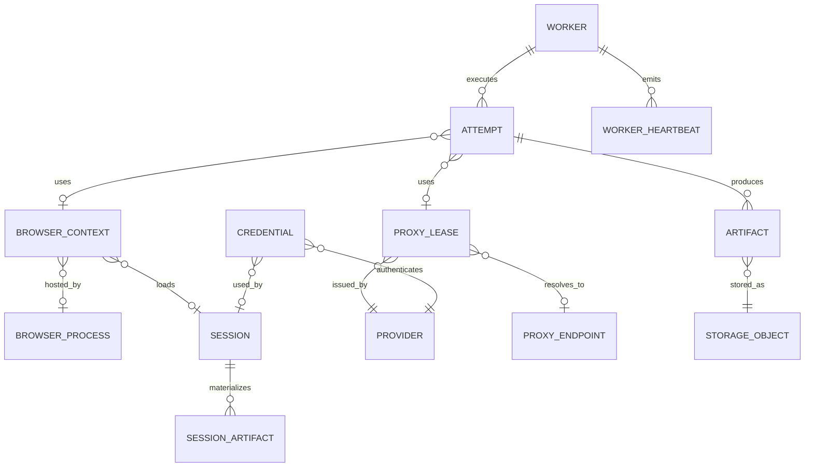

# Backend Phase 0 — P00-B06 Extended Execution Domain

**Program:** Scraping Platform  
**Kapsam:** Yalnızca backend  
**Faz:** Phase 0 — Architecture & Specification  
**Task:** P00-B06 — Worker, Browser, Session, Proxy, Provider, Credential ve Artifact modelini tanımla  
**Sürüm:** 1.0.0  
**Durum:** In Progress  
**Bağımlılık:** P00-B05 — Accepted  
**Owner:** Backend Lead

## 1. Amaç

Bu belge, çekirdek Job/Task/Attempt modelinin yürütme ve erişim varlıklarıyla nasıl ilişkilendirileceğini tanımlar. Worker, Browser, Session, Proxy, Provider, Credential ve Artifact; işin nasıl çalıştırıldığını ve hangi dış kaynaklarla ilişkilendirildiğini ifade eder. Bu varlıklar job state'in yerine geçmez; Orchestrator'ın yürütme kararını destekleyen kontrollü execution context sağlar.

## 2. İlişki diyagramı



## 3. Worker modeli

Worker, belirli task türlerini yürüten kayıtlı backend process'idir. Worker kaydı process'in yaşamını değil, orchestrator'ın worker kapasitesi ve health bilgisiyle ilgili operasyonel görünümü temsil eder.

| Alan | Tip | Kural |
|---|---|---|
| `id` | opaque UUID | Worker instance kimliği |
| `tenant_scope` | enum/list | Platform worker veya tenant-scope kısıtı |
| `worker_type` | enum | `HTTP`, `BROWSER`, `CRAWLER`, `EXTRACTOR`, `VALIDATOR` |
| `version` | string | Build/release version |
| `capabilities_json` | JSON | Supported task, artifact ve policy capabilities |
| `concurrency_limit` | integer | Worker process üst sınırı |
| `status` | enum | `STARTING`, `READY`, `BUSY`, `DRAINING`, `UNHEALTHY`, `STOPPED` |
| `last_heartbeat_at` | timestamp | Health ve lease recovery için |
| `registered_at` | timestamp | UTC |
| `metadata_json` | JSON | Region, host class, runtime; secret içermez |

### Worker invariant'ları

| Kod | Kural |
|---|---|
| WRK-001 | `READY` olmayan worker yeni task claim edemez. |
| WRK-002 | `DRAINING` worker yeni task almaz; mevcut task'lar kontrollü tamamlanır. |
| WRK-003 | Worker job state'i doğrudan değiştiremez; result event yayınlar. |
| WRK-004 | Worker heartbeat lease timeout'tan kısa aralıklarla üretilir. |
| WRK-005 | Worker capability'si task planıyla uyuşmuyorsa task claim edilmez. |
| WRK-006 | Worker restart sonrası tenant session state'i process memory'de taşınmaz. |

## 4. Browser ve BrowserContext

`BrowserProcess`, Chromium gibi browser runtime instance'ını; `BrowserContext`, tenant/job/attempt için izole sayfa çalışma alanını temsil eder. Process pool performans için paylaşılabilir; context, cookie, localStorage ve session state paylaşılmaz.

| Alan | `BrowserProcess` | `BrowserContext` |
|---|---|---|
| `id` | Process instance ID | Context ID |
| `worker_id` | Host worker | Oluşturan browser worker |
| `version` | Browser/runtime version | Inherited runtime version |
| `status` | `STARTING`, `READY`, `CRASHED`, `CLOSED` | `CREATED`, `ACTIVE`, `DISPOSING`, `DISPOSED` |
| `tenant_id` | Yok veya platform scope | Zorunlu tenant scope |
| `attempt_id` | Yok | Zorunlu attempt ilişkilendirmesi |
| `session_id` | Yok | Opsiyonel session reference |
| `created_at` | UTC | UTC |
| `closed_at` | UTC/null | Cleanup kanıtı |

### BrowserContext kuralları

Context yalnızca tek tenant ve tek attempt bağlamında kullanılmalıdır. Aynı context farklı job'lar veya tenant'lar arasında yeniden kullanılamaz. Context dispose edilmeden Browser Worker task'ı başarıyla kapanmış sayılmamalıdır. Cookie ve localStorage state, raw log veya telemetry alanlarına yazılmaz.

## 5. Session modeli

Session; izinli login, cookie, localStorage veya sticky access state'inin yürütme bağlamıdır. Session raw state değildir; raw state'in secret store veya encrypted artifact reference'ı ile ilişkilendirilen kontrol kaydıdır.

| Alan | Tip | Kural |
|---|---|---|
| `id` | opaque UUID | Session ID |
| `tenant_id` | UUID | Tenant scope |
| `target_id` | UUID | Target scope |
| `session_mode` | enum | `EPHEMERAL`, `STICKY`, `PERSISTED_BY_POLICY` |
| `state_ref` | secret/object reference | Raw cookie/state DB'ye yazılmaz |
| `credential_ref` | UUID/null | Kullanılan credential reference |
| `status` | enum | `CREATED`, `ACTIVE`, `EXPIRED`, `REVOKED`, `DISPOSED` |
| `expires_at` | timestamp | Zorunlu expiry |
| `last_used_at` | timestamp | Operasyonel görünüm |
| `created_at` | timestamp | UTC |

Session persistence yalnızca Target ve tenant policy açıkça izin veriyorsa yapılır. Job tamamlandığında ephemeral session dispose edilir. Login başarısızlığı credential değeri sızdırılmadan `CREDENTIAL_ERROR` veya hedefe uygun sınıfa dönüştürülür.

## 6. Provider modeli

Provider, proxy veya LLM gibi dış erişim sağlayıcısının normalize edilmiş katalog kaydıdır. Adapter'ın gerçek API endpoint, SDK ve secret formatı core domain'e taşınmaz.

| Alan | Tip | Kural |
|---|---|---|
| `id` | opaque UUID | Provider ID |
| `type` | enum | `PROXY`, `LLM`, `STORAGE`, `AUTH` |
| `name` | string | Tenant/platform katalog adı |
| `adapter_key` | string | İç adapter registry key; secret içermez |
| `capabilities_json` | JSON | Geo, session, browser, structured output vb. |
| `status` | enum | `CONFIGURED`, `HEALTHY`, `DEGRADED`, `QUARANTINED`, `DISABLED` |
| `credential_ref` | UUID/null | Secret manager reference |
| `pricing_ref` | string/null | Tarife snapshot reference |
| `created_at`, `updated_at` | timestamp | UTC |

Provider health ve pricing aynı gerçeklik değildir. Health snapshot zamanla değişebilir; pricing snapshot effective date ile version'lanmalıdır.

## 7. Credential modeli

Credential, provider veya yetkili Target erişimi için gereken secret'ın kendisi değil, secret store'daki referansıdır.

| Alan | Tip | Kural |
|---|---|---|
| `id` | opaque UUID | Credential reference |
| `tenant_id` | UUID | Tenant scope |
| `provider_id` | UUID/null | Provider auth için |
| `target_id` | UUID/null | Target login için |
| `secret_ref` | string | Secret manager/object reference |
| `credential_type` | enum | `API_KEY`, `BASIC_AUTH_REF`, `OAUTH_REF`, `COOKIE_STATE_REF` |
| `status` | enum | `ACTIVE`, `ROTATING`, `REVOKED`, `EXPIRED`, `INVALID` |
| `last_validated_at` | timestamp/null | Health validation metadata |
| `expires_at` | timestamp/null | Credential expiry |
| `created_by` | UUID | Actor reference |
| `created_at`, `updated_at` | timestamp | UTC |

Credential raw value hiçbir domain tablosuna, queue payload'ına, log/trace'e veya API response'una yazılmaz. Credential kullanımında `credential_id`, provider/target ve result code telemetry'ye yazılabilir; secret fingerprint yalnızca güvenli operasyon ihtiyacı varsa maskeli tutulur.

## 8. ProxyEndpoint ve ProxyLease

`ProxyEndpoint`, provider'ın sunduğu normalized erişim endpoint'ini; `ProxyLease`, tek bir Attempt için verilen süreli kullanım hakkını temsil eder. Endpoint credential veya raw proxy URL'si olarak loglanmaz.

### ProxyEndpoint

| Alan | Tip | Kural |
|---|---|---|
| `id` | opaque UUID | İç endpoint reference |
| `provider_id` | UUID | Provider foreign key |
| `proxy_class` | enum | `DATACENTER`, `ISP`, `RESIDENTIAL`, `MOBILE` |
| `country`, `city`, `asn` | string/null | Geo metadata |
| `status` | enum | `AVAILABLE`, `DEGRADED`, `QUARANTINED`, `DISABLED` |
| `health_score` | decimal | Derived, zaman damgalı |
| `last_checked_at` | timestamp | Health snapshot zamanı |

### ProxyLease

| Alan | Tip | Kural |
|---|---|---|
| `id` | opaque UUID | Lease ID |
| `tenant_id` | UUID | Tenant scope |
| `attempt_id` | UUID | Tek attempt ilişkisi |
| `provider_id` | UUID | Provider |
| `endpoint_id` | UUID/null | Normalized endpoint reference |
| `session_key_ref` | string/null | Sticky session reference; raw key yok |
| `policy_decision_ref` | UUID | Access policy kararı |
| `status` | enum | `REQUESTED`, `LEASED`, `RELEASED`, `EXPIRED`, `QUARANTINED` |
| `leased_at`, `expires_at`, `released_at` | timestamp | Lease lifecycle |
| `result_json` | JSON | Status/latency/bytes; secret yok |

Lease orphan kalmamalıdır. Attempt terminal olduğunda lease release/expire kontrolü çalışır. Provider response'da raw credential, proxy URL veya session secret varsa adapter bunu normalize etmeden core'a geçirmemelidir.

## 9. Artifact ve StorageObject

Artifact, bir Attempt, Extraction veya Export sırasında üretilen büyük veya binary çıktının metadata kaydıdır. Raw içerik database'e gömülmez; object storage reference ile ilişkilendirilir.

| Alan | Tip | Kural |
|---|---|---|
| `id` | opaque UUID | Artifact ID |
| `tenant_id` | UUID | Tenant scope |
| `attempt_id` | UUID/null | Job attempt artifact'i |
| `dataset_version_id` | UUID/null | Dataset/export artifact'i |
| `kind` | enum | `RAW_RESPONSE`, `DOM`, `SCREENSHOT`, `PDF`, `NETWORK`, `EXPORT`, `SESSION_STATE` |
| `content_type` | string | Allowlist ile doğrulanır |
| `size_bytes` | integer | Limit kontrolü |
| `storage_object_id` | UUID | Storage metadata |
| `checksum` | string | Bütünlük doğrulaması |
| `retention_class` | enum | `SHORT`, `STANDARD`, `LONG`, `LEGAL_HOLD` |
| `status` | enum | `STAGED`, `AVAILABLE`, `EXPIRED`, `DELETED`, `DELETE_FAILED` |
| `created_at`, `expires_at`, `deleted_at` | timestamp/null | Retention lifecycle |

`StorageObject` object storage bucket/key/version/checksum metadata'sıdır. Client'a doğrudan bucket yetkisi verilmez; API authorization sonrası kısa süreli presigned URL veya backend stream kullanılır.

## 10. Extended execution lifecycle

```text
Worker: STARTING → READY → BUSY → DRAINING → STOPPED
BrowserProcess: STARTING → READY → CRASHED/CLOSED
BrowserContext: CREATED → ACTIVE → DISPOSING → DISPOSED
Session: CREATED → ACTIVE → EXPIRED/REVOKED/DISPOSED
ProxyLease: REQUESTED → LEASED → RELEASED/EXPIRED/QUARANTINED
Provider: CONFIGURED → HEALTHY → DEGRADED → QUARANTINED/DISABLED
Credential: ACTIVE → ROTATING → ACTIVE veya REVOKED/EXPIRED/INVALID
Artifact: STAGED → AVAILABLE → EXPIRED → DELETED/DELETE_FAILED
```

Her lifecycle event'i ilgili tenant/attempt/job bağlamını ve reason code'u taşır. State transition owner, P00-B04 ownership matrix ile uyumlu olmalıdır.

## 11. Retention ve cleanup matrisi

| Varlık | Varsayılan cleanup | Cleanup başarısızlığı |
|---|---|---|
| BrowserContext | Attempt kapanışında dispose | Worker cleanup retry + alarm |
| Ephemeral Session | Job/Attempt tamamlanınca dispose | Secret/session cleanup retry |
| ProxyLease | Attempt terminal olduğunda release/expire | Lease age alarmı |
| Credential reference | Revoke/expiry policy ile pasifleştir | Security alarmı; raw secret zaten tutulmaz |
| Raw Artifact | Retention expiry ile sil | `DELETE_FAILED` + retry + audit |
| Screenshot/PDF | Kısa retention | Storage cleanup queue |
| Dataset export | Link expiry ve retention | Export revoke + delete task |
| Worker heartbeat | Operasyonel TTL sonrası compact | Health history aggregate |

## 12. Güvenlik invariant'ları

1. Bir BrowserContext aynı anda yalnızca bir tenant ve attempt'e aittir.
2. Session state, Credential raw value ve ProxyLease secret'ı queue/database/log/trace içine yazılmaz.
3. Credential kullanımı tenant ve resource policy ile doğrulanmadan gerçekleştirilmez.
4. Artifact URI'sı tenant authorization olmadan okunamaz.
5. Provider adapter, core domain'e raw provider payload'ı taşımaz.
6. Worker metadata'sı target URL query veya credential içermemelidir.
7. Cleanup işlemi idempotent olmalıdır; ikinci silme çağrısı tutarlı sonucu korur.

## 13. P00-B06 kabul kriterleri

P00-B06 `Accepted` sayılması için:

1. Worker, BrowserProcess, BrowserContext, Session, Provider, Credential, ProxyEndpoint, ProxyLease, Artifact ve StorageObject alanları tanımlıdır.
2. Extended entity ilişkileri ve tekil ownership sınırları core domain ile uyumludur.
3. Lease, heartbeat, session, context, credential, provider ve artifact lifecycle'ları tanımlıdır.
4. Raw secret, cookie, proxy URL ve session state'in saklama/loglama sınırı yazılıdır.
5. Retention ve cleanup davranışları idempotent ve alarm üretir biçimde tanımlıdır.
6. Phase 1–4 worker, storage ve provider task'larına aktarılabilir interface girdisi oluşmuştur.
7. Backend Lead, SRE, Security, Compliance ve Solution Architect review'ü tamamlanmıştır.

## References

[1]: ../../source/pasted_content.txt "Kullanıcı tarafından sağlanan sistem taslağı"
[2]: ../02-domain-model.md "Domain modeli ve veri sözlüğü"
[3]: phase-0-m0-core-domain.md "P00-B05 core domain model"
[4]: phase-0-m0-service-ownership.md "P00-B04 servis ve veri sahipliği"
[5]: phase-0-m0-backend-requirements.md "Backend gereksinim register'ı"
[6]: phase-0-m0-backend-security.md "Backend security baseline"
