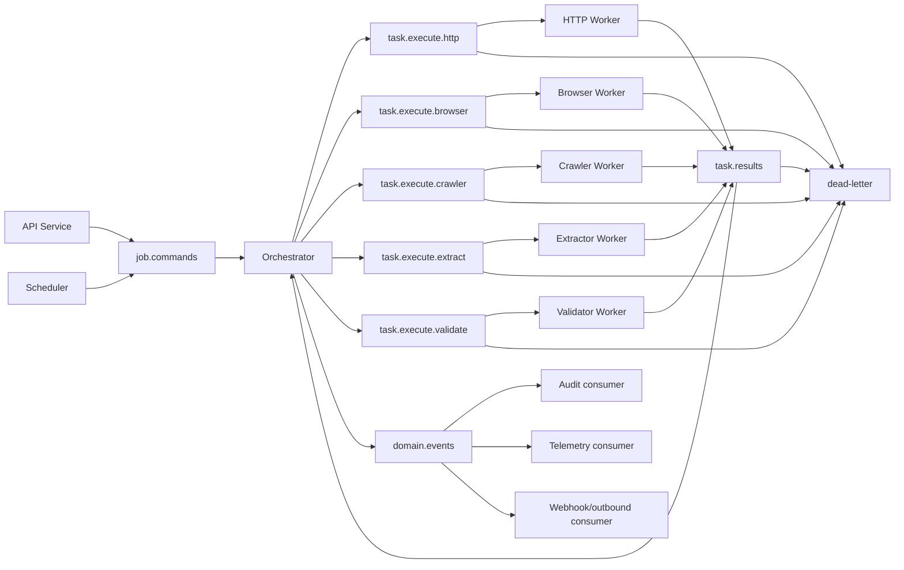

# Backend Phase 0 — P00-B09 Queue Topology ve Message Contract

**Program:** Scraping Platform  
**Kapsam:** Yalnızca backend  
**Faz:** Phase 0 — Architecture & Specification  
**Task:** P00-B09 — Queue topology, message envelope ve routing sözleşmesini tasarla  
**Sürüm:** 1.0.0  
**Durum:** In Progress  
**Bağımlılık:** P00-B04, P00-B07 ve P00-B08 — Accepted  
**Owner:** Backend Lead

## 1. Amaç

Bu belge, backend servisleri arasındaki asenkron iletişimin Redis/BullMQ üzerinde nasıl modellenip işletileceğini tanımlar. Queue sistemi; API'nin uzun işleri bloklamadan command kabul etmesini, Orchestrator'ın worker task'larını dağıtmasını, worker result'larının geri toplanmasını, retry/DLQ yönetimini ve telemetry correlation'ını sağlar.

Queue, domain state'in authoritative kaynağı değildir. Job, Run, Task ve Attempt gerçekliği PostgreSQL'de tutulur; Redis/BullMQ delivery, lease, delay ve geçici execution koordinasyonu için kullanılır.

## 2. Queue topology



## 3. Queue kataloğu

| Queue | Producer | Consumer | Mesaj tipi | Öncelik |
|---|---|---|---|---|
| `job.commands` | API, Scheduler | Orchestrator | `job.create`, `job.cancel`, `job.retry` | Yüksek |
| `task.execute.http` | Orchestrator | HTTP Worker | `task.execute` | Normal |
| `task.execute.browser` | Orchestrator | Browser Worker | `task.execute` | Normal/yüksek maliyet kontrollü |
| `task.execute.crawler` | Orchestrator | Crawler Worker | `task.execute` | Normal |
| `task.execute.extract` | Orchestrator | Extractor Worker | `task.execute` | Normal |
| `task.execute.validate` | Orchestrator | Validator Worker | `task.execute` | Normal |
| `task.results` | All Workers | Orchestrator | `task.succeeded`, `task.failed` | Yüksek |
| `domain.events` | State owners | Audit/telemetry/callback | `job.*`, `dataset.*`, `provider.*` | Normal |
| `dead-letter` | Queue consumers | SRE/operator tooling | Poison/terminal message | Operasyon |

Queue adı environment namespace ile prefix'lenebilir: `scraping:{env}:{queueName}`. Tenant kimliği queue adında kullanılmamalı; tenant envelope içinde taşınmalı ve yüksek queue cardinality oluşturulmamalıdır.

## 4. Ortak message envelope

Tüm command, result ve event mesajları aşağıdaki ortak envelope'ı taşır:

```json
{
  "messageId": "msg_01J...",
  "messageType": "task.execute",
  "schemaVersion": 1,
  "tenantId": "tenant_01J...",
  "projectId": "project_01J...",
  "jobId": "job_01J...",
  "runId": "run_01J...",
  "taskId": "task_01J...",
  "attemptId": "attempt_01J...",
  "correlationId": "corr_01J...",
  "traceId": "trace_01J...",
  "causationId": "msg_parent_01J...",
  "producer": {
    "service": "orchestrator",
    "version": "0.1.0"
  },
  "issuedAt": "2026-08-26T10:00:01Z",
  "deadlineAt": "2026-08-26T10:00:31Z",
  "payload": {}
}
```

| Alan | Zorunlu | Kural |
|---|:---:|---|
| `messageId` | Evet | Global veya environment scope'ta benzersiz |
| `messageType` | Evet | Consumer routing ve schema seçimi |
| `schemaVersion` | Evet | Breaking payload değişikliklerinde artırılır |
| `tenantId` | Evet | Auth context'ten türetilir; worker değiştiremez |
| `projectId` | Domain mesajlarında | Project scope ve query guard |
| `jobId`/`runId`/`taskId`/`attemptId` | Execution mesajlarında | Execution lineage |
| `correlationId` | Evet | Kullanıcı niyeti/command zinciri |
| `traceId` | Evet | Distributed trace propagation |
| `causationId` | Event/result mesajlarında | Hangi mesajın sonucu olduğunu gösterir |
| `producer` | Evet | Servis ve release bilgisi |
| `issuedAt` | Evet | Clock skew policy ile yorumlanır |
| `deadlineAt` | Execution mesajlarında | Worker total deadline |
| `payload` | Evet | Message type/schemaVersion'a bağlı içerik |

Raw credential, cookie, authorization header, session state, büyük response body veya private URL query queue payload'ına konulmaz. Büyük veri object storage'a yazılır; envelope yalnızca artifact reference, checksum ve content metadata taşır.

## 5. Mesaj tipleri

### 5.1 Job command

```json
{
  "messageType": "job.create",
  "schemaVersion": 1,
  "payload": {
    "jobId": "job_01J...",
    "runId": "run_01J...",
    "targetId": "target_01J...",
    "schemaId": "schema_01J...",
    "executionSnapshotRef": "artifact://...",
    "idempotencyKey": "job-create-key"
  }
}
```

`job.create` consumer'ı Job/Run/Task consistency ve idempotency'yi doğrular. Aynı message tekrarlandığında yeni Job veya yeni initial Task üretmez.

### 5.2 Task execute

```json
{
  "messageType": "task.execute",
  "schemaVersion": 1,
  "payload": {
    "taskType": "HTTP_FETCH",
    "targetUrl": "https://example.com/products",
    "executionPlanRef": "artifact://plan/01J...",
    "attemptNo": 1,
    "maxAttempts": 3
  }
}
```

`targetUrl` envelope içinde kullanılabilir; query'de secret varsa maskelenmiş/normalize edilmiş görünüm kullanılmalıdır. Gerçek yürütme planı büyük veya hassas ise reference üzerinden güvenli biçimde alınır.

### 5.3 Task result

```json
{
  "messageType": "task.succeeded",
  "schemaVersion": 1,
  "causationId": "msg_execute_01J...",
  "payload": {
    "taskId": "task_01J...",
    "attemptId": "attempt_01J...",
    "resultStatus": "SUCCESS",
    "artifactRefs": [
      {
        "artifactId": "artifact_01J...",
        "kind": "RAW_RESPONSE",
        "checksum": "sha256:...",
        "sizeBytes": 48320
      }
    ],
    "usage": {
      "requestCount": 1,
      "responseBytes": 48320,
      "durationMs": 842
    }
  }
}
```

Result consumer, worker'ın bildirdiği sonucu doğrudan job completion olarak kabul etmez. Attempt ve Task sonucu kaydedilir; Orchestrator sonraki transition ve dispatch kararını verir.

## 6. Delivery semantics

MVP'de queue delivery **at-least-once** olarak ele alınmalıdır. Consumer crash veya ack kaybında aynı mesaj yeniden teslim edilebilir. Bu sebeple producer ve consumer işlemleri idempotent tasarlanır. Exactly-once varsayımı yapılmaz.

| Durum | Beklenen davranış |
|---|---|
| Mesaj alındı, işlem başarılı, ack kayboldu | Mesaj tekrar gelir; idempotency mevcut sonucu korur |
| Worker işlem sırasında crash oldu | Lease/visibility timeout sonrası task reclaim edilir |
| Result duplicate geldi | `messageId`/attempt key ile ignore veya same-result |
| Eski event yeni state sonrası geldi | Sequence/state guard ile geriye dönüş engellenir |
| Consumer schema desteklemiyor | Message quarantine/DLQ; sessiz discard yok |
| Provider yavaş | Deadline, heartbeat ve retry policy devreye girer |

## 7. Outbox ve güvenilir publish

API veya Orchestrator'ın database state'i ile queue publish arasındaki kayıp riski transactional outbox veya eşdeğer bir pattern ile ele alınır.

```text
DB transaction:
  1. Domain state yaz
  2. Outbox event yaz
commit

Publisher:
  3. Outbox event claim
  4. Queue publish
  5. Publish receipt / retry metadata yaz
```

Outbox event'i publish edilmeden silinmez. Publisher duplicate publish yapabilir; consumer `messageId` idempotency ile aynı domain etkisini ikinci kez uygulamaz. Outbox age, unpublished count ve publish error metric'leri alarm kapsamındadır.

## 8. Retry ve backoff

Queue retry ile domain retry ayrıdır. Queue retry; transient broker/consumer failure içindir. Domain retry; HTTP timeout, provider error veya policy tarafından retryable kabul edilen task execution içindir. İki retry bütçesi ayrı sayaçlarda tutulmalıdır.

```text
queueDelay = min(queueBase * 2^deliveryAttempt + jitter, queueMax)
domainDelay = min(domainBase * 2^attemptNo + jitter, domainMax)
```

Retry mesajı yeni `messageId` taşıyabilir ancak aynı `taskId` ve yeni `attemptId` ile ilişkilendirilmelidir. Aynı attempt'i yeniden kullanmak yalnızca düşük seviyeli broker redelivery için geçerlidir; yeni domain denemesi yeni Attempt kaydı üretir.

## 9. DLQ ve replay

Dead-letter mesajı; retry budget tükendiğinde, schemaVersion desteklenmediğinde, poison payload bulunduğunda veya consumer terminal kararı verdiğinde kullanılır.

| DLQ alanı | Açıklama |
|---|---|
| `deadLetterId` | DLQ kayıt kimliği |
| `originalMessageId` | İlk mesaj |
| `queueName` | Kaynak queue |
| `failureCode` | Neden DLQ'ya alındı |
| `deliveryCount` | Deneme sayısı |
| `firstFailedAt`, `lastFailedAt` | Zamanlar |
| `payloadHash` | İçerik checksum; hassas payload raw tutulmaz |
| `replayAllowed` | Policy sonucu |
| `quarantineReason` | Operator inceleme notu |

Replay yalnızca yetkili operator komutu ile yapılır. Replay öncesi schema, tenant, job/task status, budget ve current state doğrulanır. Replay idempotent değildir varsayımıyla yapılmaz; her replay command'ı audit log üretir.

## 10. Ordering ve concurrency

Queue genelinde global ordering garanti edilmez. Aynı Job/Task aggregate'i için state transition sırası Orchestrator ve database optimistic lock/sequence kontrolüyle korunur. Worker concurrency target, tenant, provider ve worker kapasitesine göre sınırlanır.

Browser task'ları ile HTTP task'ları farklı queue ve worker pool kullanır. Bir tenant veya target'ın tek bir job'ı tüm platform worker kapasitesini tüketmemelidir; fair scheduling ve quota uygulanmalıdır.

## 11. Backpressure

Queue depth, queue wait, active worker ve downstream dependency health birlikte değerlendirilir. Backpressure durumunda sistem:

1. Yeni task dispatch'ini yavaşlatır veya duraklatır.
2. Browser/LLM gibi pahalı task'lar için budget/policy kontrolünü yeniden çalıştırır.
3. Target rate limit ve provider quota sınırlarını korur.
4. API command kabulünde bağımlılık veya budget durumunu açıkça bildirir.
5. Operatöre queue ve dependency alarmı üretir.

Sınırsız memory queue veya queue mesajına büyük payload koyma yaklaşımı kullanılmaz.

## 12. Queue güvenliği

Queue bağlantısı authenticated ve network-restricted olmalıdır. Consumer; envelope içindeki tenant/job/task bağlamını database'deki authoritative kayıtla karşılaştırmadan işlem yapmamalıdır. Message payload'ı değiştirilmiş veya imzası/formatı geçersiz ise quarantine edilir.

Queue loglarında payload'ın tamamı basılmaz. `messageId`, message type, schemaVersion, tenant hash/reference, job/task/attempt ID ve payload checksum gibi düşük hassasiyetli alanlar kullanılır.

## 13. Şema uyumluluğu

Consumer, desteklediği `schemaVersion` aralığını açıkça belirtir. Backward-compatible alan ekleri aynı major sözleşmede olabilir; alan silme, tip değiştirme veya anlam değişikliği yeni version ister. Eski versiyonlar migration/adapter ile normalize edilebilir; bilinmeyen version sessizce işlenmez.

## 14. Queue gözlemlenebilirliği

Zorunlu metrikler: queue depth, enqueue rate, claim rate, queue wait, processing duration, delivery count, retry count, DLQ count, outbox age, consumer error rate, worker heartbeat age ve message schema rejection'dır.

Log/trace correlation: `messageId`, `correlationId`, `causationId`, `traceId`, `jobId`, `taskId` ve `attemptId`. Secret ve raw payload redaction zorunludur.

## 15. P00-B09 kabul kriterleri

P00-B09 `Accepted` sayılması için:

1. Queue kataloğu, producer/consumer ve task routing'i tanımlıdır.
2. Ortak message envelope zorunlu alanları ve secret/büyük payload sınırı yazılıdır.
3. Job command, task execute ve task result örnekleri bulunmaktadır.
4. At-least-once delivery, idempotency, duplicate ve out-of-order davranışı açıklanmıştır.
5. Outbox/güvenilir publish, retry, backoff, DLQ ve replay kuralları tanımlıdır.
6. Ordering, concurrency, backpressure ve tenant quota sınırları belirlenmiştir.
7. Queue security, schema versioning ve telemetry standartları mevcuttur.
8. Phase 1 Redis/BullMQ implementation, P00-B10 lifecycle ve P00-B11 reliability task'larına aktarılabilir.
9. Backend Lead, Orchestrator owner, SRE, Security ve QA review'ü tamamlanmıştır.

## References

[1]: ../../source/pasted_content.txt "Kullanıcı tarafından sağlanan sistem taslağı"
[2]: ../03-api-contract.md "Genel API sözleşmesi"
[3]: ../04-lifecycles.md "Yaşam döngüleri"
[4]: phase-0-m0-backend-architecture.md "Backend context/container architecture"
[5]: phase-0-m0-service-ownership.md "Servis ve veri sahipliği"
[6]: phase-0-m0-error-idempotency.md "Error taxonomy ve idempotency"
