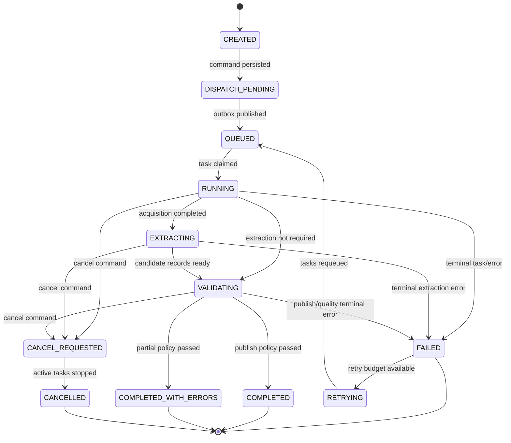
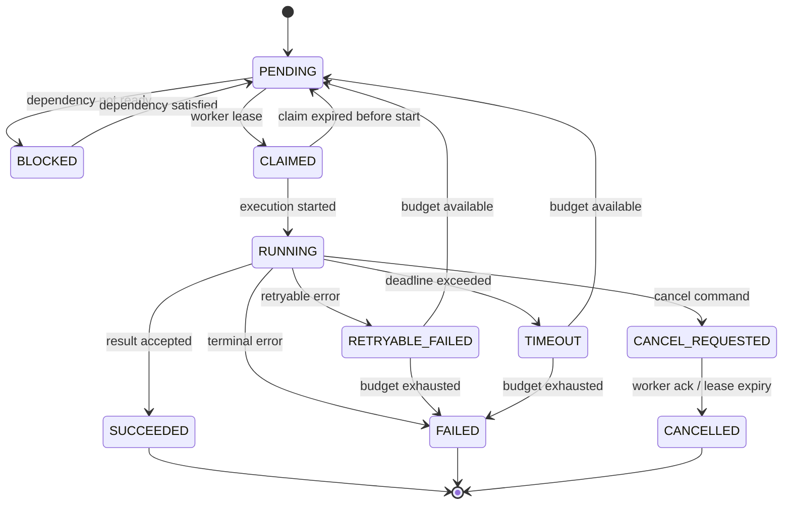
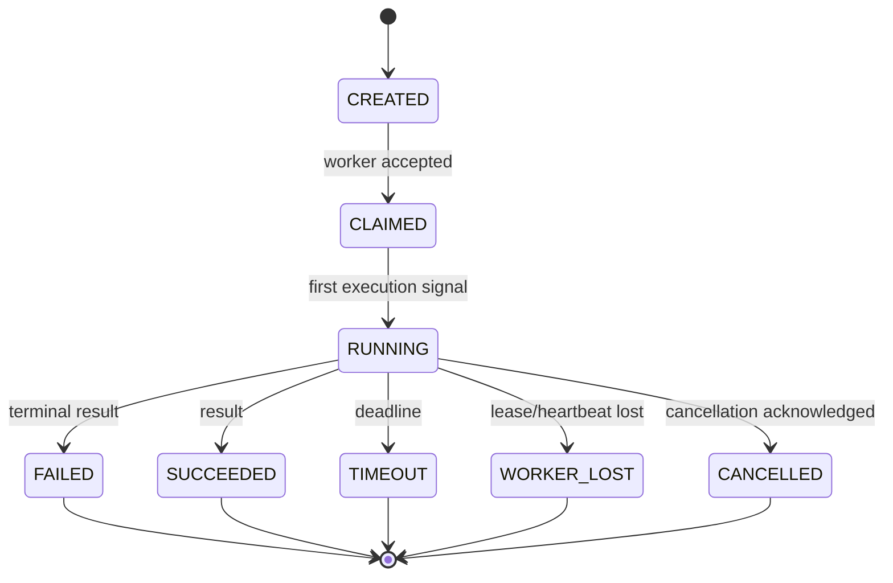

# Backend Phase 0 — P00-B10 Lifecycle Contract

**Program:** Scraping Platform  
**Kapsam:** Yalnızca backend  
**Faz:** Phase 0 — Architecture & Specification  
**Task:** P00-B10 — Job, Task ve Attempt durum makinelerini kesinleştir  
**Sürüm:** 1.0.0  
**Durum:** In Progress  
**Bağımlılık:** P00-B09 — Accepted  
**Owner:** SRE/Platform Lead

## 1. Amaç

Bu belge, backend'deki Job, Task ve Attempt yürütme durumlarını ve geçerli state transition'larını tanımlar. Lifecycle contract; Orchestrator, queue consumer, worker, retry, cancellation, reconciliation ve API status görünümünün ortak referansıdır.

Durum alanı mevcut state'i gösterir; transition event'i ise state'in neden değiştiğini, hangi actor/service tarafından yapıldığını ve hangi önceki state'ten geldiğini gösterir. Kritik geçişler append-only event veya audit metadata ile izlenir.

## 2. Lifecycle ownership

| Lifecycle | Authoritative owner | Worker rolü | API rolü |
|---|---|---|---|
| Job/Run | Orchestrator | Result üretir | Command kabul eder/read eder |
| Task | Orchestrator | Claim/heartbeat/result | Read/cancel command |
| Attempt | Orchestrator + worker result | Execution gözlemi | Read |
| Worker health | Worker Registry/SRE | Heartbeat üretir | Read |
| Dataset version | Dataset/Validator | Validation input | Read/export command |

Worker hiçbir Job state'ini doğrudan `COMPLETED`, `FAILED` veya `CANCELLED` yapamaz. Worker yalnızca Attempt sonucu ve telemetry yayınlar. Orchestrator result event'i ve mevcut state'i birlikte değerlendirerek transition yapar.

## 3. Job state machine



### Job durumları

| Durum | Anlam | Giriş | Çıkış |
|---|---|---|---|
| `CREATED` | Job metadata transaction içinde oluşturuldu | API/Scheduler command | Dispatch pending |
| `DISPATCH_PENDING` | Outbox/queue publish bekleniyor | Job create commit | Queued veya failed |
| `QUEUED` | En az bir task dispatch edilebilir | Publish receipt | Running |
| `RUNNING` | En az bir task yürütülüyor | Task claim | Extract/validate/fail/cancel |
| `EXTRACTING` | Candidate record üretimi sürüyor | Acquisition success | Validate/fail/cancel |
| `VALIDATING` | Schema/quality/publish kontrolleri sürüyor | Extraction result | Completed/partial/fail/cancel |
| `COMPLETED` | Publish policy tam karşılandı | Validation success | Terminal |
| `COMPLETED_WITH_ERRORS` | Partial policy ile kabul edilebilir çıktı | Validation summary | Terminal |
| `FAILED` | Retry edilemeyen veya bütçesi tükenen hata | Task/validation error | Retrying veya terminal |
| `RETRYING` | Retry planı hazırlanıyor | Retry decision | Queued |
| `CANCEL_REQUESTED` | Cancel command kabul edildi | User/policy command | Cancelled |
| `CANCELLED` | Yeni dispatch durdu, aktif işler kapandı | Worker acknowledgements/lease expiry | Terminal |

## 4. Task state machine



Task durumları, worker lifecycle'dan ayrı tutulur. `CLAIMED` yalnızca lease alındığını, `RUNNING` ise execution'ın başladığını gösterir. Worker heartbeat kaybolduğunda task hemen `FAILED` yapılmaz; lease/visibility timeout sonunda reclaim ve retry kararı verilir.

## 5. Attempt state machine



Attempt record'i append-only execution geçmişidir. Aynı Task için retry yeni `attemptNo` ve `attemptId` üretir. Broker redelivery aynı attempt'in duplicate teslimidir; yeni domain attempt değildir.

## 6. Geçerli transition tablosu

| Aggregate | From | To | Actor | Zorunlu kanıt |
|---|---|---|---|---|
| Job | `CREATED` | `DISPATCH_PENDING` | API/Orchestrator | Job create transaction + outbox |
| Job | `DISPATCH_PENDING` | `QUEUED` | Orchestrator | Publish receipt veya reconcile record |
| Job | `QUEUED` | `RUNNING` | Orchestrator | Task claim/dispatch event |
| Job | `RUNNING` | `EXTRACTING` | Orchestrator | Acquisition result |
| Job | `EXTRACTING` | `VALIDATING` | Orchestrator | Extraction result reference |
| Job | `VALIDATING` | `COMPLETED` | Orchestrator | Dataset publish + quality policy |
| Job | `VALIDATING` | `COMPLETED_WITH_ERRORS` | Orchestrator | Partial-result policy |
| Job | active | `FAILED` | Orchestrator | Terminal error code |
| Job | active | `CANCEL_REQUESTED` | API/Orchestrator | Authorized cancel command |
| Job | `CANCEL_REQUESTED` | `CANCELLED` | Orchestrator | No active task veya lease expiry |
| Job | `FAILED` | `RETRYING` | Orchestrator | Retry policy + budget |
| Job | `RETRYING` | `QUEUED` | Orchestrator | New attempt/task dispatch |
| Task | `PENDING` | `CLAIMED` | Worker/Queue | Lease ID |
| Task | `CLAIMED` | `RUNNING` | Worker | Start signal |
| Task | `RUNNING` | `SUCCEEDED` | Orchestrator | Validated result event |
| Task | `RUNNING` | `RETRYABLE_FAILED` | Orchestrator | Retryable error + budget |
| Task | `RUNNING` | `FAILED` | Orchestrator | Terminal error |
| Task | `RUNNING` | `TIMEOUT` | Orchestrator | Deadline/lease evidence |
| Task | active | `CANCEL_REQUESTED` | Orchestrator | Authorized cancel |
| Task | `CANCEL_REQUESTED` | `CANCELLED` | Orchestrator | Worker ack/lease expiry |

Geçersiz transition `STATE_CONFLICT` veya internal lifecycle error olarak kaydedilir. Consumer duplicate event ile aynı transition'ı tekrar görürse sonuç idempotent olmalıdır.

## 7. Lease ve heartbeat kuralları

Task claim, `leaseId`, `leaseExpiresAt`, `workerId` ve `attemptId` üretir. Worker heartbeat lease bitmeden yenilenir. Heartbeat kaybı, aşağıdaki koşullar birlikte değerlendirilerek recovery başlatır:

1. `leaseExpiresAt` geçmiş olmalıdır.
2. Task hala `CLAIMED` veya `RUNNING` olmalıdır.
3. Aynı task için daha yeni fencing/lease sahibi bulunmamalıdır.
4. Cancellation veya terminal result daha önce kabul edilmemiş olmalıdır.

Fencing token veya monotonik lease sequence, eski worker'ın geç gelen sonucunun yeni attempt'i ezmesini engeller. Lease recovery sırasında eski worker tekrar bağlanırsa result reject/quarantine edilir ve `STALE_ATTEMPT_RESULT` olarak kaydedilir.

## 8. Completion kuralları

Job `COMPLETED` yalnızca tüm zorunlu task'lar başarılı, validation/publish policy geçti ve dataset version publish edildiğinde olur. `COMPLETED_WITH_ERRORS`, yalnızca Job policy `allowPartialResults=true` ve minimum valid record/quality koşulları karşılandığında kullanılabilir.

Job içinde task sayıları, valid/invalid record, error ve cost summary derived olabilir; ancak completion transition'ın dayandığı snapshot korunmalıdır. Sonradan gelen duplicate veya eski event terminal Job state'i geriye çeviremez.

## 9. Cancellation kuralları

Cancel command kabul edilince Orchestrator yeni task dispatch etmez, aktif task'lara cancellation signal gönderir ve job'ı `CANCEL_REQUESTED` yapar. Worker dış request'i anında durduramıyorsa lease/deadline süresi içinde kapanması beklenir. `CANCELLED` job yeni result publish edemez; tamamlanmış ancak yayınlanmamış staging verisi abort/cleanup policy'sine girer.

## 10. Transition metadata

Her transition aşağıdaki alanları taşımalıdır:

```json
{
  "transitionId": "transition_01J...",
  "aggregateType": "job",
  "aggregateId": "job_01J...",
  "tenantId": "tenant_01J...",
  "fromStatus": "RUNNING",
  "toStatus": "EXTRACTING",
  "reasonCode": "ACQUISITION_SUCCEEDED",
  "actorType": "service",
  "actorId": "orchestrator",
  "causationId": "msg_01J...",
  "traceId": "trace_01J...",
  "occurredAt": "2026-08-26T10:00:04Z"
}
```

## 11. Reconciliation

Reconciliation; queue'da olup database'de karşılığı olmayan task, database'de dispatch bekleyip queue'da bulunmayan command, lease'i sona ermiş aktif task, orphan proxy lease, publish edilmeyen outbox ve terminal job altında kalan aktif task'ları tarar. Reconciliation otomatik düzeltme yapmadan önce reason ve dry-run sonucu üretmelidir; yüksek etkili replay operator onayı gerektirir.

## 12. P00-B10 kabul kriterleri

P00-B10 `Accepted` sayılması için:

1. Job, Task ve Attempt state machine diyagramları ve durum sözlükleri tanımlıdır.
2. Geçerli transition tablosunda actor, kanıt ve hedef state bellidir.
3. Worker lease, heartbeat, fencing ve stale result davranışı yazılıdır.
4. Job completion, partial result, cancellation ve terminal state kuralları açıklanmıştır.
5. Duplicate/out-of-order event ve invalid transition davranışı tanımlıdır.
6. Transition metadata ve reconciliation kapsamı belirlenmiştir.
7. Queue contract ve ownership matrix ile lifecycle çelişmemektedir.
8. SRE, Backend, QA, Security ve Orchestrator owner review'ü tamamlanmıştır.

## References

[1]: ../../source/pasted_content.txt "Kullanıcı tarafından sağlanan sistem taslağı"
[2]: ../04-lifecycles.md "Genel yaşam döngüleri"
[3]: phase-0-m0-queue-contract.md "Queue topology ve message contract"
[4]: phase-0-m0-error-idempotency.md "Error taxonomy ve idempotency"
[5]: phase-0-m0-core-domain.md "Core domain model"
[6]: phase-0-m0-service-ownership.md "Servis ve veri sahipliği"
