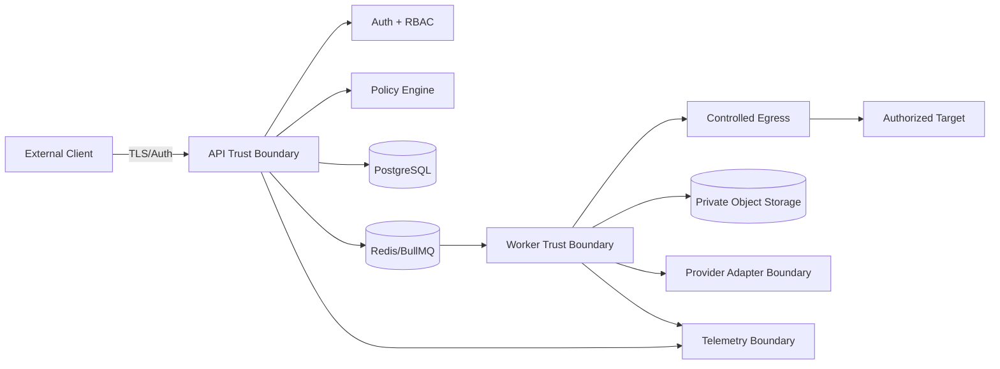

# Backend Phase 0 — P00-B12 Security Baseline

**Program:** Scraping Platform  
**Kapsam:** Yalnızca backend  
**Faz:** Phase 0 — Architecture & Specification  
**Task:** P00-B12 — Threat boundary, RBAC ve tenant isolation modelini tasarla  
**Sürüm:** 1.0.0  
**Durum:** In Progress  
**Bağımlılık:** P00-B03 ve P00-B11 — Accepted  
**Owner:** Security Lead

## 1. Amaç

Bu belge, backend'in güvenlik sınırlarını, tehdit modelini, RBAC yapısını, tenant izolasyonunu ve güvenli resource erişim prensiplerini tanımlar. Phase 0'da amaç güvenlik kontrollerinin kapsamını ve sahipliğini kesinleştirmektir; uygulama hardening, tarama ve penetration test Phase 15'te tamamlanır.

> **Uyum sınırı:** Backend yalnızca yetkili veya policy tarafından izin verilmiş veri toplama işlerini destekler. CAPTCHA veya erişim bariyerlerini saldırgan biçimde aşan, yetkisiz credential kullanan veya policy ihlalini otomatik retry eden bir davranış ürün kabiliyeti değildir.

## 2. Trust boundary



### Güven sınırları

| Sınır | Güven seviyesi | Kontrol |
|---|---|---|
| External Client → API | Güvenilmeyen | TLS, authentication, schema validation, rate limit |
| API → Database | İç servis | Service identity, least privilege, tenant query guard |
| API/Orchestrator → Queue | İç servis fakat mesaj değişebilir | Authenticated connection, envelope validation, idempotency |
| Queue → Worker | Kısmen güvenilir execution boundary | Lease, capability, tenant match, resource limit |
| Worker → Target | Güvenilmeyen dış ağ | Egress policy, host/port validation, response limits |
| Worker → Provider | Dış bağımlılık | Adapter, credential reference, health/cost policy |
| Worker → Storage | İç/dış servis sınırı | Private bucket, scoped URI, checksum, presigned access |
| Services → Telemetry | Veri sızıntısı riski | Redaction, allowlisted attributes, access RBAC |

## 3. Tehdit kategorileri

| Tehdit | Etkilenen alan | Phase 0 kontrolü | Phase 15 doğrulaması |
|---|---|---|---|
| Cross-tenant data access | DB/API/queue/storage | Tenant context ve ownership matrix | Negative integration/security test |
| SSRF ve unsafe egress | Target fetcher/webhook | IP/port/host/redirect policy | Egress penetration test |
| Credential leakage | Provider/Target/Browser/log | Secret reference, masking, no raw payload | Secret scanning ve redaction test |
| Broken access control | API/admin/export | RBAC + resource scope | Authorization matrix test |
| Duplicate/forged event | Queue/orchestrator | Message validation/idempotency | Replay/tamper test |
| Browser context leakage | Browser/session | Context per tenant/attempt | Isolation and cleanup test |
| Malicious external content | Parser/extractor/LLM | Untrusted content boundary | Prompt/data injection review |
| Data retention violation | DB/storage/session | Data classification and retention baseline | Deletion/restore evidence |
| Abuse/cost exhaustion | API/worker/LLM/proxy | Rate/concurrency/budget controls | Load and budget abuse test |
| Audit gap | Admin/data action | Append-only audit event contract | Audit completeness review |

## 4. Kimlik doğrulama baseline'ı

Backend, kullanıcı oturumu ve programatik API key için provider-agnostic auth interface kullanır. Auth provider seçimi Phase 1 kickoff'ta kesinleştirilir; provider değişimi API authorization core'unu değiştirmemelidir.

| Identity | Kullanım | Zorunlu kontrol |
|---|---|---|
| User session | Dashboard/API insan etkileşimi | Expiry, revocation, secure cookie/token, actor context |
| API key | Entegrasyon/automation | Hash-only persistence, prefix, revoke, last-used metadata |
| Service identity | API/Orchestrator/Worker | Audience/scope, short-lived veya rotate edilebilir credential |
| Provider credential | Proxy/LLM/Storage erişimi | Secret manager reference, no raw log, rotation |
| Target credential | Yetkili hedef login | Target scope, explicit policy, short retention |

Authentication başarısızlığında resource existence veya tenant bilgisi sızdırılmamalıdır. Revoked veya expired identity yeni command başlatamaz; mevcut job cancellation ve audit davranışı policy ile tanımlıdır.

## 5. RBAC modeli

RBAC; role, tenant ve resource scope birleşimiyle uygulanır. `tenantId` istemci body'sinden yetki kaynağı olarak alınmaz; authenticated context'ten türetilir.

| Rol | Project/Target/Schema | Job/Task | Dataset/Export | Provider/Credential | User/Audit |
|---|---|---|---|---|---|
| `owner` | Tam | Tam | Tam | Tam; secret değeri görünmez | Tam |
| `admin` | Tam | Tam | Tam | Provider yönetimi; credential raw yok | User yönetimi/audit |
| `operator` | Okuma/target ayarı | Başlatma/iptal/retry | Okuma/export | Health okuma; secret yok | Audit okuma |
| `developer` | Okuma/yazma | Başlatma/sorgu | Okuma/export | Adapter config; secret yok | Teknik audit |
| `viewer` | Okuma | Okuma | Okuma | Yok | Yok/sınırlı |
| `service_worker` | Task snapshot okuma | Kendi attempt/result scope'u | Staging batch yazma | Lease alma | Worker event |

Her eylem merkezi authorization policy ile değerlendirilir:

```text
can(actor, action, tenantId, resourceType, resourceId, context)
```

Policy sonucu yalnızca boolean değil, `decision`, `reasonCode`, `policyVersion` ve `evaluatedAt` metadata'sı üretebilir. Bu metadata audit ve troubleshooting için raw secret olmadan kaydedilir.

## 6. Resource authorization

API resource lookup'ı iki aşamalı yapılmalıdır: tenant scope ile kaynak bulma, ardından actor/resource action yetkisi. Kaynak tenant dışında ise ayrı bir "var ama yetkisiz" cevabı üreterek bilgi sızıntısı yapılmamalıdır; dış API'de güvenli `404 RESOURCE_NOT_FOUND` standardı kullanılabilir.

| İşlem | Örnek yetki | Ek kontrol |
|---|---|---|
| Project read | `project:read` | Tenant scope |
| Target update | `target:write` | Project membership, policy validation |
| Job create | `job:create` | Target/schema same tenant/project, budget |
| Job cancel | `job:cancel` | Job actor scope, current lifecycle |
| Job retry | `job:retry` | Retryable error, remaining budget |
| Dataset export | `dataset:export` | Version access, export policy, audit |
| Credential use | `credential:use` | Target/provider scope, explicit policy |
| Provider update | `provider:admin` | Admin re-auth, audit |
| DLQ replay | `ops:replay` | Approval, budget, schema/state check |
| Audit read | `audit:read` | Admin/security scope, masking |

## 7. Tenant isolation

Tenant isolation defense-in-depth olarak uygulanır:

1. Auth context tenant ID'si request context'e yazılır.
2. Repository method'ları tenant scope olmadan kaynak sorgusu çalıştırmaz.
3. Queue envelope tenant ID taşır; consumer database'deki owner ile karşılaştırır.
4. Object storage key'i tenant/project/job/attempt hiyerarşisini kullanır.
5. Presigned URL oluşturulmadan önce resource authorization yeniden çalışır.
6. Worker/browser context tenant dışı reference kabul etmez.
7. Audit ve usage event tenant ID taşır.
8. Cross-tenant negatif testleri release gate'in parçasıdır.

## 8. Database security

Database servis hesabı yalnızca ihtiyacı olan tablo/operation kapsamına sahip olmalıdır. Migration yetkisi runtime API/worker hesabından ayrılmalıdır. Tenant filtreleri repository katmanında ve kritik sorgularda açıkça korunmalıdır. Raw SQL kullanımı parameterized ve review'e tabi olmalıdır.

Database backup, audit ve artifact referansları da tenant boundary içinde değerlendirilir. Debug veya ad hoc sorgu sırasında raw credential, session state ve kişisel veri çıktısı alınmamalıdır.

## 9. Queue ve worker security

Queue bağlantısı authenticated, network-restricted ve environment-scoped olmalıdır. Worker mesajı işlerken:

| Kontrol | Davranış |
|---|---|
| Schema validation | Bilinmeyen message type/version quarantine |
| Tenant match | Envelope tenant ile DB resource tenant eşleşmiyorsa reject |
| Capability | Worker task type yeteneği yoksa claim etmez |
| Lease/fencing | Eski worker result'ı yeni attempt'i ezemez |
| Payload size | Büyük body yerine artifact reference kullanılır |
| Secret scan | Secret/cookie/auth header pattern'leri reddedilir veya maskelenir |
| Resource limit | CPU/memory/time/concurrency sınırı uygulanır |
| Audit | Replay, reject ve security anomaly event'i kaydedilir |

Worker process'leri least privilege ile çalışır. Browser process veya parser; API, database admin veya secret store üzerinde gereksiz yetkiye sahip olmamalıdır.

## 10. SSRF ve controlled egress baseline'ı

Kullanıcıdan gelen URL, webhook URL'si, redirect ve keşfedilmiş link güvenilmeyen girdidir. Egress policy aşağıdaki kontrolleri içerir:

| Kontrol | Kural |
|---|---|
| Scheme | Yalnızca izinli scheme; varsayılan HTTP/HTTPS policy |
| Host | Target allowlist veya tenant policy ile eşleşme |
| Port | Explicit allowlist; beklenmeyen admin/internal port yok |
| IP | Loopback, private, link-local, metadata ve reserved bloklar reddedilir |
| Redirect | Her hop'ta host/port/IP policy yeniden değerlendirilir |
| DNS | Resolve edilen adres ile bağlantı hedefi tutarlılığı korunur |
| Response | Content type, decompressed size ve total deadline sınırı |
| Webhook | Destination allowlist/private IP guard ve imza |

İzinli hedeflerin gerçek ağ gereksinimleri bulunuyorsa exception açık owner, gerekçe, süre ve audit kaydıyla tanımlanır; genel private network erişimi açılmaz.

## 11. Secret ve data redaction

Secret yalnızca secret manager/reference katmanında bulunur. Aşağıdaki değerler log, trace, audit metadata, queue payload ve API response'tan çıkarılır veya maskelenir: API key, bearer token, password, cookie, Set-Cookie, session state, raw proxy URL, private query token ve target credential.

Redaction testleri; anahtar adı ve pattern bazlı çalışmalı, structured log ve nested JSON dahil edilmelidir. `details` alanına provider raw response veya stack trace eklenmez. Hata incelemesi için güvenli fingerprint ve correlation ID kullanılır.

## 12. Audit baseline

Kritik backend eylemleri append-only audit event üretir:

| Event | Örnek action |
|---|---|
| Identity | `login`, `logout`, `api_key.created`, `identity.revoked` |
| Authorization | `access.denied`, `policy.denied`, `scope.changed` |
| Resource | `project.updated`, `target.policy_changed`, `schema.published` |
| Execution | `job.created`, `job.cancelled`, `job.retried`, `dlq.replayed` |
| Data | `dataset.exported`, `record.deleted`, `retention.executed` |
| Secret | `credential.created`, `credential.used`, `credential.revoked` |
| Provider | `provider.enabled`, `provider.quarantined`, `health_changed` |

Audit event; actor, tenant, resource, request/trace, action, result, reason ve occurredAt taşır. Raw secret veya tam dış response audit'e yazılmaz.

## 13. Security acceptance test matrisi

| Test alanı | Örnek senaryo | Beklenen sonuç |
|---|---|---|
| Cross-tenant read | Tenant A ID'si ile Tenant B job sorgusu | `404`/güvenli reddetme, veri yok |
| Cross-tenant write | Tenant A task command'ı Tenant B job'a | Reject + audit |
| Role escalation | Viewer job retry dener | `403`/güvenli reddetme |
| API key revoke | Revoked key ile command | Auth failure |
| Secret leakage | Hata/trace/log içinde credential gönderimi | Maskeli veya yok |
| SSRF | Private/metadata/loopback URL | Dış çağrı yapılmadan reject |
| Redirect escape | İzinli hosttan private hosta redirect | Reject |
| Webhook escape | Unsafe destination | Config/delivery reject |
| Queue tamper | Tenant veya job ID değişmiş envelope | Quarantine/reject |
| Browser leakage | Context state başka tenant'tan okunur | Isolation failure; test fail |
| Export access | Yetkisiz dataset export | Reject; link üretilmez |
| Audit completeness | Admin/credential/job action | Audit event bulunur |

## 14. P00-B12 kabul kriterleri

P00-B12 `Accepted` sayılması için:

1. Trust boundary ve tehdit kategorileri backend bileşenleriyle eşleştirilmiştir.
2. Auth, RBAC, role/resource scope ve merkezi authorization yaklaşımı tanımlıdır.
3. Tenant isolation; database, queue, worker, storage ve audit katmanlarında açıklanmıştır.
4. SSRF/egress, redirect, private IP/port ve webhook destination baseline'ı yazılıdır.
5. Secret/redaction, worker least privilege ve queue security kuralları belirlenmiştir.
6. Audit event kapsamı ve security acceptance test matrisi mevcuttur.
7. Phase 1 implementation ve Phase 15 hardening task'larına trace edilebilir.
8. Security Lead, Backend Lead, SRE, Compliance ve QA review'ü tamamlanmıştır.

## References

[1]: ../../source/pasted_content.txt "Kullanıcı tarafından sağlanan sistem taslağı"
[2]: ../07-security-rbac.md "Genel güvenlik ve RBAC dokümanı"
[3]: phase-0-m0-backend-requirements.md "Backend gereksinim register'ı"
[4]: phase-0-m0-service-ownership.md "Servis ve veri sahipliği"
[5]: phase-0-m0-execution-domain.md "Extended execution domain"
[6]: phase-0-m0-queue-contract.md "Queue topology ve message contract"
[7]: phase-0-m0-reliability-policy.md "Reliability policy"
