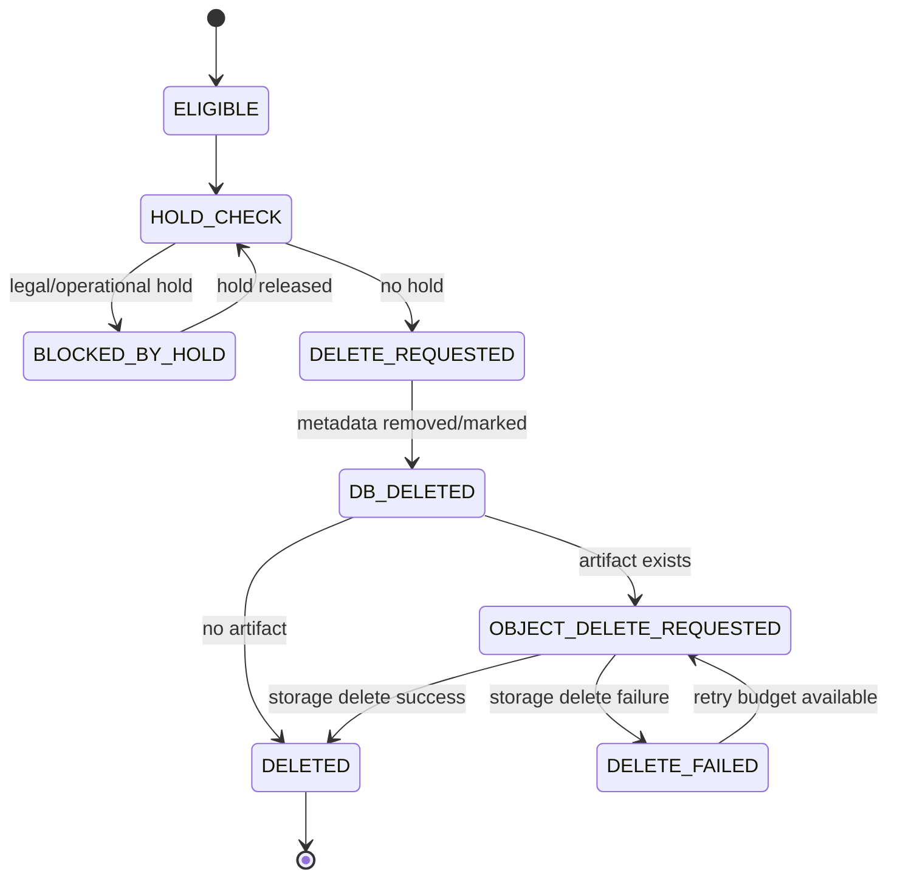

# Backend Phase 0 — P00-B14 Data Governance Baseline

**Program:** Scraping Platform  
**Kapsam:** Yalnızca backend  
**Faz:** Phase 0 — Architecture & Specification  
**Task:** P00-B14 — Retention, deletion, audit ve dataset lineage baseline'ını tanımla  
**Sürüm:** 1.0.0  
**Durum:** In Progress  
**Bağımlılık:** P00-B05 ve P00-B13 — Accepted  
**Owner:** Compliance/Legal

## 1. Amaç

Bu belge, backend'in ürettiği ve sakladığı verilerin yaşam döngüsünü tanımlar. Amaç; ham response, browser artifact'i, session state, dataset, log, audit ve usage event'lerinin farklı risk ve kullanım ihtiyaçlarına göre sınıflandırılması; silme, lineage, erişim ve denetim davranışlarının teknik sözleşmeye dönüştürülmesidir.

> **Planlama sınırı:** Bu dokümandaki retention değerleri teknik başlangıç önerisidir; gerçek süreler tenant sözleşmesi, veri sınıfı, kurum politikası ve uygulanabilir mevzuat incelemesiyle kesinleştirilmelidir. Bu belge hukuki görüş yerine backend uygulama baseline'ı sunar.

## 2. Veri sınıfları

| Sınıf | Veri örnekleri | Hassasiyet | Ana kullanım |
|---|---|---|---|
| D1 — Execution metadata | Job, Task, Attempt, status, error code, duration | Orta | Operasyon, troubleshooting, lineage |
| D2 — Raw acquisition | HTML, JSON response, DOM, network payload | Orta/yüksek | Re-extraction, evidence, debug |
| D3 — Browser/session | Cookie state, localStorage, login/session artifact | Yüksek | Yetkili session devamlılığı |
| D4 — Credential reference | Secret manager ref, credential status, expiry | Yüksek | Provider/target access control |
| D5 — Dataset output | Published DatasetVersion, Record, quality, export | Tenant/sözleşme bazlı | İş çıktısı |
| D6 — Telemetry | Structured log, metric, trace | Orta; içerik varsa yüksek | Gözlemlenebilirlik |
| D7 — Audit | Actor, action, resource, result, time | Yüksek | Denetim ve güvenlik |
| D8 — Usage/cost | Request, browser seconds, proxy, LLM, storage, compute, retry | Orta | Maliyet ve faturalama |
| D9 — Backup/replica | DB/object backup ve restore metadata | Kaynağa bağlı | Kurtarma |

## 3. Retention baseline

Aşağıdaki değerler uygulama için başlangıç varsayımıdır. Tenant veya ürün policy'si daha kısa veya uzun süre belirleyebilir; daha uzun saklama için açık owner ve gerekçe bulunmalıdır.

| Veri sınıfı | Başlangıç retention önerisi | Silme davranışı | Owner |
|---|---:|---|---|
| D1 Execution metadata | 180 gün | Soft delete/compaction sonrası fiziksel cleanup | Orchestrator/SRE |
| D2 Raw acquisition | 30 gün | Artifact delete + metadata status | Storage/DE |
| D3 Browser/session | Job bitişi veya en fazla 24 saat | Dispose/revoke; legal hold hariç | Browser/Security |
| D4 Credential reference | Credential policy/expiry | Revoke reference; raw secret secret store policy'siyle | Security |
| D5 Published dataset | Tenant/contract policy | Version archive/delete; lineage kaydı korunabilir | Dataset/PO |
| D6 Logs/traces | 30 gün | Backend retention lifecycle | SRE |
| D7 Audit | Kurum policy'si | Append-only; kontrollü archive | Security/Compliance |
| D8 Usage/cost | 24 ay veya faturalama policy'si | Aggregate/archive; düzeltme event'i korunur | FinOps |
| D9 Backup/replica | Recovery policy'si | Backup lifecycle ile | SRE |

Retention süresi dolduğunda veri hemen sessizce silinmemelidir. Cleanup job önce eligible records üretir, legal hold/status kontrolü yapar, delete command yayınlar, sonucu audit eder ve başarısız parçaları retry kuyruğuna alır.

## 4. Retention policy modeli

```json
{
  "tenantId": "tenant_01J...",
  "policyVersion": 3,
  "effectiveAt": "2026-08-26T00:00:00Z",
  "classes": {
    "rawAcquisitionDays": 30,
    "browserSessionHours": 24,
    "executionMetadataDays": 180,
    "datasetDays": 365,
    "telemetryDays": 30,
    "usageEventDays": 730
  },
  "legalHoldEnabled": true,
  "approvedBy": "actor_01J..."
}
```

Policy version job/dataset/artifact metadata'sına snapshot olarak bağlanmalıdır. Policy sonradan değişse bile geçmiş artifact'in hangi policy ile üretildiği görülebilmelidir. Retention hesaplaması `createdAt`, `publishedAt`, `lastAccessedAt` ve veri sınıfına göre açık bir anchor kullanmalıdır.

## 5. Dataset lineage

Published record veya dataset version aşağıdaki lineage zincirini taşımalıdır:

```text
Tenant
  → Project
    → Target + targetSnapshot
      → Job + run
        → Task
          → Attempt + effectiveStrategy
            → Artifact / source URL
              → ExtractionPlan version
                → Schema version
                  → Validation result
                    → DatasetVersion
                      → Record
```

### Minimum lineage alanları

| Alan | Kullanım |
|---|---|
| `tenantId`, `projectId` | Ownership ve izolasyon |
| `targetId`, `sourceUrlHash` | Kaynak referansı; hassas query raw tutulmaz |
| `jobId`, `runId`, `taskId`, `attemptId` | Execution trace |
| `schemaId`, `schemaVersion` | Veri sözleşmesi |
| `extractionPlanId`, `extractionPlanVersion` | Extraction reproducibility |
| `artifactId`, `checksum` | Ham kanıt referansı |
| `extractedAt`, `validatedAt`, `publishedAt` | Zaman çizgisi |
| `qualityScore`, `validationSummary` | Kalite açıklaması |
| `recordKey` | Dedupe/upsert ve record identity |

Raw response veya session content lineage metadata'sına gömülmemelidir. Record consumer'ı source evidence'e erişecekse API authorization ve presigned artifact policy yeniden değerlendirilmelidir.

## 6. Audit kapsamı

Audit log; veri içeriğini değil, kim ne zaman hangi kaynağa hangi eylemi uyguladı sorusunu cevaplamalıdır.

| Domain | Audit eylemleri |
|---|---|
| Identity | Login, logout, API key create/revoke, identity revoke |
| Authorization | Access denied, policy denied, scope change |
| Resource | Project/Target/Schema create/update/archive/delete |
| Execution | Job create/cancel/retry, schedule trigger, DLQ replay |
| Data | Dataset publish/export/delete, record deletion, retention run |
| Secret | Credential create/use/rotate/revoke; raw secret yok |
| Provider | Enable/disable, quarantine, health override, tariff update |
| Administration | Role change, config change, feature flag, exception approval |

### Audit event modeli

```json
{
  "id": "audit_01J...",
  "tenantId": "tenant_01J...",
  "actorId": "user_01J...",
  "actorType": "user",
  "action": "dataset.export.created",
  "resourceType": "dataset_version",
  "resourceId": "dataset_version_01J...",
  "requestId": "req_01J...",
  "traceId": "trace_01J...",
  "result": "accepted",
  "reasonCode": "AUTHORIZED",
  "metadata": {
    "format": "jsonl",
    "recordCount": 500
  },
  "occurredAt": "2026-08-26T10:00:00Z"
}
```

Audit metadata yalnız allowlist alanları kabul etmelidir. Raw query, cookie, token, response body, credential, session state veya kişisel veri serbest metadata olarak yazılamaz.

## 7. Deletion lifecycle



Silme command'ı idempotent olmalıdır. Metadata zaten silinmişse mevcut storage reference kontrol edilir; object storage'da object yoksa işlem başarılı kabul edilebilir. `DELETE_FAILED` kaydı; artifact ID, storage object reference, error code ve sonraki retry zamanını taşır.

## 8. Legal/operational hold

Hold, retention cleanup'ın belirli veri veya dataset üzerinde durmasını sağlayan işaretleyicidir. Hold oluşturma, kapsam, gerekçe, owner, başlangıç ve kaldırma koşulunu taşır. Hold aktifken veri silinmez veya archive edilmez; erişim yine RBAC ile korunur.

| Hold alanı | Açıklama |
|---|---|
| `holdId` | Hold kimliği |
| `scopeType` | Tenant/project/job/dataset/artifact |
| `scopeId` | Kapsam kimliği |
| `reason` | Serbest veri yerine sınırlı/approved reason code |
| `createdBy` | Actor |
| `createdAt` | UTC |
| `expiresAt` | Opsiyonel zorunlu review zamanı |
| `status` | `ACTIVE`, `RELEASED`, `EXPIRED` |

Hold özelliğinin hukuki uygulaması kurum policy'sine bağlıdır; backend yalnız teknik enforcement sağlar.

## 9. Data minimization

Backend yalnızca yürütme, doğrulama, lineage, operasyon ve sözleşmesel çıktı için gerekli veriyi saklamalıdır. HTML cleaner veya LLM input pipeline gereksiz script/style/navigasyon içeriğini ayırmalıdır. Log ve trace içerik yerine metadata ve referans kullanmalıdır. Session state ve credential değeri, ihtiyacın bittiği anda temizlenmelidir.

Export formatları kişisel veya hassas veriyi tenant policy'sinden daha geniş bir scope'a açmamalıdır. CSV/spreadsheet çıktılarında formula benzeri değerler için güvenli encoding uygulanmalıdır.

## 10. Backup ve deletion tutarlılığı

Backup restore sonrası retention/deletion policy yeniden uygulanabilir olmalıdır. Silinmiş artifact'in eski backup'tan istemciye yeniden görünmemesi için restore sonrası deletion tombstone veya deletion event yeniden oynatılabilir. Backup lifecycle ve tenant deletion talebi arasında source-of-truth kararı SRE/Compliance tarafından ayrıca kaydedilmelidir.

## 11. Data access ve export audit

Dataset record okuma, artifact indirme, export oluşturma ve presigned link üretme audit veya access event üretebilir. Access event; record payload'ını içermez, yalnız kaynak, actor, miktar/format, result ve zaman bilgisini taşır. Admin veya support erişimi tenant owner policy'sine göre ayrıca loglanmalıdır.

## 12. P00-B14 kabul kriterleri

P00-B14 `Accepted` sayılması için:

1. Backend verileri veri sınıfı, hassasiyet, owner ve kullanım amacıyla sınıflandırılmıştır.
2. Execution metadata, raw artifact, session, credential, dataset, telemetry, audit ve usage için retention başlangıç politikası vardır.
3. Dataset lineage; target/job/task/attempt/artifact/schema/validation/dataset/record zincirini taşır.
4. Audit event kapsamı, şeması, redaction ve append-only davranışı tanımlıdır.
5. Retention cleanup, legal/operational hold, deletion state machine ve idempotent silme akışı yazılıdır.
6. Database, object storage, backup ve deletion tutarlılığı ele alınmıştır.
7. Data minimization ve export access kuralları belirlenmiştir.
8. Phase 1, Phase 11 ve Phase 15 uygulama/güvenlik task'larına trace edilebilir.
9. Compliance, Security, Backend, SRE, Data/Extraction ve Product review'ü tamamlanmıştır.

## References

[1]: ../../source/pasted_content.txt "Kullanıcı tarafından sağlanan sistem taslağı"
[2]: ../02-domain-model.md "Domain modeli ve veri sözlüğü"
[3]: ../07-security-rbac.md "Güvenlik, RBAC ve tenant izolasyonu"
[4]: ../08-observability-cost.md "Gözlemlenebilirlik ve maliyet"
[5]: phase-0-m0-core-domain.md "Core domain model"
[6]: phase-0-m0-security-controls.md "Security control matrix"
