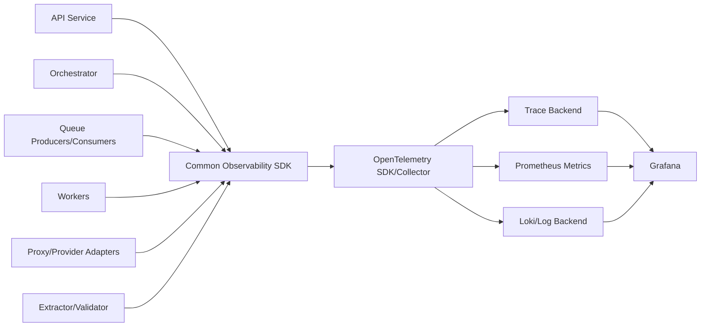

# Backend Phase 0 — P00-B15 Observability Standardı

**Program:** Scraping Platform  
**Kapsam:** Yalnızca backend  
**Faz:** Phase 0 — Architecture & Specification  
**Task:** P00-B15 — Trace, log, metric, correlation ve cardinality standardını tasarla  
**Sürüm:** 1.0.0  
**Durum:** In Progress  
**Bağımlılık:** P00-B09 ve P00-B10 — Accepted  
**Owner:** SRE/Platform Lead

## 1. Amaç

Bu standardın amacı, API'den queue'ya, Orchestrator'dan worker'a, proxy/target erişiminden extraction/validation ve storage yazımına kadar tek bir backend işinin uçtan uca izlenebilmesini sağlamaktır. Telemetry; yalnızca debug aracı değil, job state, güvenlik, veri kalitesi, maliyet ve operasyon kararlarının gözlemlenebilir kanıtıdır.

## 2. Telemetry mimarisi



Her servis aynı logger, context propagation, metric naming, redaction ve trace helper paketini kullanmalıdır. Servislerin farklı timestamp, correlation veya severity formatı üretmesine izin verilmez.

## 3. Correlation sözleşmesi

| Alan | Kaynak | Zorunluluk | Kullanım |
|---|---|:---:|---|
| `requestId` | API request veya generated | API boundary | İstemci/HTTP korelasyonu |
| `traceId` | Trace context | Tüm servisler | Distributed trace |
| `spanId` | Current span | Trace event | Span ilişkilendirme |
| `correlationId` | Kullanıcı niyeti/Job command | Job zinciri | Aynı iş akışı |
| `causationId` | Önceki message/event | Event/result | Nedensellik |
| `tenantId` | Auth/domain context | Backend event | Tenant isolation |
| `projectId` | Domain context | Job kaynakları | Project kırılımı |
| `jobId` | Execution context | Job event | Job izleme |
| `taskId` | Task context | Task event | Task izleme |
| `attemptId` | Attempt context | Worker event | Tek yürütme denemesi |
| `messageId` | Queue envelope | Queue | Duplicate/replay |

Correlation alanları raw secret veya hassas query taşımamalıdır. `tenantId` erişim kontrollü telemetry'de tutulur; dış kullanıcıya veya geniş erişimli metric label'a dönüştürülmez.

## 4. Trace standardı

### 4.1 Span isimleri

| Span | Başlangıç noktası | Zorunlu attribute'lar |
|---|---|---|
| `api.request` | API middleware | route, method, status, requestId |
| `auth.evaluate` | Auth/RBAC | actorType, action, decision, policyVersion |
| `db.query` | Repository | operation, table family, result count; raw SQL yok |
| `outbox.publish` | Outbox publisher | messageType, queue, publish result |
| `queue.publish` | Producer | queue, messageType, messageId |
| `queue.consume` | Consumer | queue, messageType, deliveryAttempt |
| `orchestrator.transition` | Orchestrator | aggregate, from, to, reasonCode |
| `worker.attempt` | Worker | workerType, taskType, attemptNo |
| `proxy.acquire` | Proxy Manager | provider, proxyClass, decision; secret yok |
| `target.request` | HTTP/Browser | host, method, statusClass, duration |
| `extract.run` | Extractor | mode, planVersion, recordCount |
| `validate.run` | Validator | schemaVersion, validCount, qualityScore |
| `artifact.write` | Storage adapter | kind, contentType, size, checksum status |
| `dataset.publish` | Dataset owner | version, recordCount, qualityScore |
| `usage.record` | Cost service | category, unit, estimated/actual |

### 4.2 Trace status

Span `OK`, `ERROR` veya `UNSET` durumlarından birini taşır. Beklenen target 404 veya schema field missing gibi domain sonucu, platform exception'ı değilse span'ı gereksiz yere `ERROR` yapmamalıdır; result/status attribute ve error classification kullanılmalıdır.

### 4.3 Sampling

MVP'de error, slow request, security deny, lifecycle transition ve cost anomaly trace'leri korunmalıdır. Başarılı ve yüksek hacimli target request trace'leri sampling ile azaltılabilir; ancak job/attempt lineage'i kaybolmamalıdır. Sampling policy tenant veya high-value job için artırılabilir.

## 5. Structured log standardı

```json
{
  "timestamp": "2026-08-26T10:00:01.123Z",
  "level": "INFO",
  "service": "orchestrator",
  "version": "0.1.0",
  "environment": "staging",
  "message": "Task result accepted",
  "requestId": "req_01J...",
  "traceId": "trace_01J...",
  "correlationId": "corr_01J...",
  "tenantId": "tenant_01J...",
  "jobId": "job_01J...",
  "taskId": "task_01J...",
  "attemptId": "attempt_01J...",
  "messageId": "msg_01J...",
  "taskType": "HTTP_FETCH",
  "resultStatus": "SUCCESS",
  "durationMs": 842
}
```

| Alan grubu | Kural |
|---|---|
| Time/service/version | Her logda bulunur |
| Correlation | İlgili context varsa bulunur |
| Domain IDs | Tenant/job/task/attempt ihtiyaca göre bulunur |
| Message | Secret veya raw payload içermez |
| Error | Stable code, retryable, fingerprint ve safe details |
| Target | Host/method/status class; query/token yok |
| Data | Count/size/checksum; raw record/body yok |

`DEBUG` logları production'da varsayılan kapalıdır. Log seviyesi runtime'da kontrollü olarak değiştirilebilir; secret redaction kapatılamaz.

## 6. Redaction standardı

Redaction middleware aşağıdaki alanları maskeler veya çıkarır:

```text
Authorization
Cookie
Set-Cookie
X-Api-Key
password
secret
access_token
refresh_token
session_state
proxy_url
credential
rawResponse
htmlBody
```

Nested object, array, exception details ve provider response'ları recursive redaction'dan geçer. Query parametreleri allowlist dışında maskelenir. Raw response veya session artifact telemetry'ye yazılmaz; güvenli artifact reference ve checksum kullanılabilir.

## 7. Metric naming ve label standardı

Metrik isimleri lowercase snake_case ve birim suffix'i ile tanımlanır. Counter `_total`, histogram `_seconds`, `_bytes` veya `_duration_ms` gibi tutarlı isim taşır.

### 7.1 Platform metrikleri

| Metrik | Tür | İzinli label'lar |
|---|---|---|
| `api_requests_total` | Counter | route, method, status_class |
| `api_request_duration_seconds` | Histogram | route, status_class |
| `queue_depth` | Gauge | queue, task_type |
| `queue_wait_seconds` | Histogram | queue, task_type |
| `queue_delivery_attempts_total` | Counter | queue, result |
| `outbox_pending_count` | Gauge | event_type |
| `outbox_oldest_age_seconds` | Gauge | event_type |
| `job_state_transitions_total` | Counter | from_state, to_state, reason_code |
| `task_execution_total` | Counter | task_type, result |
| `task_duration_seconds` | Histogram | task_type, result |
| `worker_heartbeat_age_seconds` | Gauge | worker_type |

### 7.2 Execution ve kalite metrikleri

| Metrik | Tür | İzinli label'lar |
|---|---|---|
| `target_requests_total` | Counter | host_group, mode, status_class |
| `target_request_duration_seconds` | Histogram | host_group, mode |
| `proxy_leases_total` | Counter | provider, proxy_class, result |
| `proxy_health_score` | Gauge | provider, proxy_class |
| `extraction_records_total` | Counter | schema_group, mode, result |
| `validation_records_total` | Counter | schema_group, result |
| `quality_score` | Histogram | schema_group |
| `artifact_write_total` | Counter | kind, result |
| `dataset_publish_total` | Counter | result |

`jobId`, `taskId`, `attemptId`, full URL, record ID, arbitrary selector veya serbest kullanıcı metni metric label olarak kullanılamaz. Bu alanlar log/trace içinde controlled access ile tutulabilir.

## 8. Event ve state telemetry

Her önemli state transition için şu metadata yazılır:

```json
{
  "aggregateType": "job",
  "aggregateId": "job_01J...",
  "fromStatus": "RUNNING",
  "toStatus": "EXTRACTING",
  "reasonCode": "ACQUISITION_SUCCEEDED",
  "causationId": "msg_01J...",
  "traceId": "trace_01J..."
}
```

Duplicate transition `duplicate=true`, stale result `stale=true`, policy reject `policyDecision=DENY` ve budget stop `budgetDecision=EXCEEDED` gibi kontrollü alanlarla görünür kılınabilir.

## 9. Error ve security telemetry

Error log'ları stable error code, category, retryable, severity, owner, safe details ve fingerprint taşır. Security deny event'leri actor/resource existence sızdırmadan action, policyVersion, reasonCode, tenant ve request/trace ile kaydedilir.

Güvenlik telemetry'si operasyon dashboard'ından ayrı erişim policy'sine tabi olabilir. Audit log domain event'in yerini tutmaz; kritik yönetim ve erişim eylemleri ayrıca audit event'i üretir.

## 10. Retention ve erişim

| Telemetry | Başlangıç retention | Erişim |
|---|---:|---|
| Application log | 30 gün | Engineering/SRE, maskeli |
| Error/security log | 90 gün | Security/SRE |
| Trace | 14–30 gün | Engineering/SRE |
| Metrics | 13 ay trend; yüksek resolution kısa | SRE/Product summary |
| Audit event | Kurum policy'si | Security/Compliance |
| Cost/usage telemetry | 24 ay veya billing policy | FinOps/SRE |

Retention süreleri teknik başlangıçtır; tenant ve kurum policy'si ile değişebilir. Telemetry backend'ine erişim RBAC ile korunmalı, export raw log yerine maskeli query sonucuyla yapılmalıdır.

## 11. Alarm baseline'ı

| Alarm | Severity | İlk aksiyon |
|---|---|---|
| `outbox_oldest_age_high` | High | Publish worker ve DB bağlantısını kontrol et |
| `queue_wait_high` | Medium/High | Worker kapasitesi/backpressure kontrolü |
| `worker_heartbeat_stale` | High | Worker drain/restart ve lease recovery |
| `dlq_growth` | High | Error code kırılımı ve poison payload incelemesi |
| `target_error_spike` | Medium | Target/provider/circuit ayrımı |
| `quality_score_drop` | High | Schema/selector drift incelemesi |
| `artifact_write_failure` | High | Storage/quota/credential kontrolü |
| `security_denial_spike` | High | Auth/policy/abuse incelemesi |
| `cost_attribution_missing` | Medium | Usage event completeness review |

## 12. Dashboard minimumu

MVP backend dashboard'ları en az aşağıdaki görünümleri sağlar: API/queue overview, worker health, job lifecycle, target/provider health, extraction quality, error taxonomy, DLQ/outbox, security event summary ve cost/usage completeness. Her dashboard environment, time range, service ve kontrollü tenant/project filtresi sunar.

## 13. P00-B15 kabul kriterleri

P00-B15 `Accepted` sayılması için:

1. Ortak correlation alanları ve propagation kuralları tanımlıdır.
2. API, queue, orchestrator, worker, proxy, target, extraction, validation ve storage span isimleri bellidir.
3. Structured log schema, severity ve redaction kuralları yazılıdır.
4. Platform, execution, quality, worker ve queue metric'leri isim/label sözleşmesiyle tanımlıdır.
5. High-cardinality alanların metric label olarak kullanımı engellenmiştir.
6. Error/security telemetry ve audit ayrımı açıklanmıştır.
7. Retention, access, sampling ve alarm baseline'ı bulunmaktadır.
8. Phase 1 temel emission ve Phase 13 genişletilmiş observability task'larına aktarılabilir.
9. SRE, Backend, Security, QA, Product ve FinOps review'ü tamamlanmıştır.

## References

[1]: ../../source/pasted_content.txt "Kullanıcı tarafından sağlanan sistem taslağı"
[2]: ../08-observability-cost.md "Genel gözlemlenebilirlik ve maliyet dokümanı"
[3]: phase-0-m0-backend-requirements.md "Backend gereksinim register'ı"
[4]: phase-0-m0-queue-contract.md "Queue topology ve message contract"
[5]: phase-0-m0-lifecycle-contract.md "Lifecycle contract"
[6]: phase-0-m0-security-controls.md "Security control matrix"
[7]: phase-0-m0-data-governance.md "Data governance baseline"
