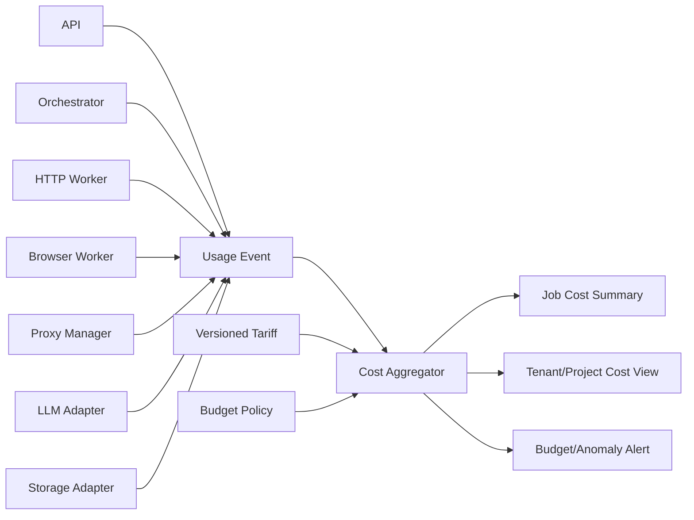

# Backend Phase 0 — P00-B16 Cost Model

**Program:** Scraping Platform  
**Kapsam:** Yalnızca backend  
**Faz:** Phase 0 — Architecture & Specification  
**Task:** P00-B16 — Usage event, cost category ve cost attribution modelini tanımla  
**Sürüm:** 1.0.0  
**Durum:** In Progress  
**Bağımlılık:** P00-B05 ve P00-B15 — Accepted  
**Owner:** FinOps/Operations

## 1. Amaç

Bu belge, backend kaynak tüketiminin tenant, project, job, task ve attempt seviyesinde ölçülmesini ve maliyetin yeniden hesaplanabilir biçimde ilişkilendirilmesini tanımlar. Amaç; yalnız toplam maliyeti göstermek değil, **hangi execution strategy'sinin, provider'ın, retry'nin veya AI kullanımının hangi kalite sonucuna hangi maliyetle ulaştığını** görünür kılmaktır.

M0'da kesin provider tarifesi veya faturalama taahhüdü yapılmaz. Sistem birim fiyatı, fiyat kaynağı, effective date ve tahmini/gerçek ayrımını taşıyacak şekilde modellenir.

## 2. Cost boundary



## 3. Cost category sözlüğü

| Kategori | Birim | Kaynak | Attribution scope |
|---|---|---|---|
| `http_request` | request | HTTP Worker | tenant/project/job/task/attempt/target |
| `http_bandwidth` | byte/GB | HTTP Worker | tenant/project/job/attempt |
| `browser_seconds` | second | Browser Worker | tenant/project/job/task/attempt |
| `browser_artifact_bytes` | byte | Browser/Storage | tenant/project/job/artifact |
| `proxy_request` | request | Proxy Manager/provider | tenant/project/job/attempt/provider |
| `proxy_bandwidth` | byte/GB | Proxy Manager/provider | tenant/project/job/attempt/provider |
| `llm_input_tokens` | token | LLM adapter | tenant/project/job/task/attempt/model |
| `llm_output_tokens` | token | LLM adapter | tenant/project/job/task/attempt/model |
| `storage_bytes` | byte/GB-day | Storage adapter | tenant/project/job/dataset/artifact |
| `compute_seconds` | second | Worker/runtime meter | tenant/project/job/task/worker_type |
| `retry_attempt` | attempt | Orchestrator/worker | tenant/project/job/task/attempt |
| `provider_fee` | currency | Provider invoice/import | tenant/project/job/provider |

## 4. Usage event modeli

```json
{
  "id": "usage_01J...",
  "tenantId": "tenant_01J...",
  "projectId": "project_01J...",
  "jobId": "job_01J...",
  "taskId": "task_01J...",
  "attemptId": "attempt_01J...",
  "category": "browser_seconds",
  "quantity": 42.7,
  "unit": "second",
  "unitCost": 0.0002,
  "estimatedCost": 0.00854,
  "currency": "USD",
  "tariffId": "tariff_01J...",
  "source": "runtime_meter",
  "idempotencyKey": "attempt_01J...:browser_seconds",
  "occurredAt": "2026-08-26T10:00:02Z",
  "metadata": {
    "providerId": null,
    "workerType": "BROWSER",
    "sourceRegion": "default"
  }
}
```

### Zorunlu kullanım event alanları

| Alan | Kural |
|---|---|
| `id` | Event kimliği; append-only |
| `tenantId` | Auth/domain context'ten türetilir |
| `jobId` veya üst scope | Tüketim bir işe bağlıysa zorunlu |
| `category` | Controlled vocabulary |
| `quantity`/`unit` | Negatif olmayan ölçüm |
| `unitCost` | Tariff snapshot'tan; yoksa null + reason |
| `estimatedCost` | Hesaplanabilir tahmini tutar |
| `currency` | Tariff veya kurum para birimi |
| `tariffId` | Fiyat kaynağı ve version |
| `source` | Runtime/provider/invoice/adjustment |
| `idempotencyKey` | Duplicate meter event önleme |
| `occurredAt` | UTC |

Raw provider credential, URL query, response body veya record payload usage event'e yazılmaz.

## 5. Tariff modeli

Tarife, geçmiş cost summary'lerini değiştirmeyecek şekilde versioned tutulur.

| Alan | Açıklama |
|---|---|
| `tariffId` | Tarife sürüm kimliği |
| `providerId` | Provider/model/worker referansı |
| `category` | Cost category |
| `unit` | request, byte, second, token vb. |
| `unitCost` | Birim fiyat |
| `currency` | Para birimi |
| `effectiveFrom` | Uygulama başlangıcı |
| `effectiveTo` | Opsiyonel bitiş |
| `source` | Contract, invoice, internal allocation |
| `approvedBy` | FinOps/owner |
| `status` | `DRAFT`, `ACTIVE`, `RETIRED` |

Yeni tarife mevcut event'leri geriye dönük değiştirmez. Gerçek fatura geldiğinde `invoice_adjustment` veya correction event ile fark kaydedilir; eski tahmin silinmez.

## 6. Cost aggregation

Job total cost aşağıdaki kategorilerin toplamından oluşur:

```text
jobCost = httpCost
        + browserCost
        + proxyCost
        + llmCost
        + storageCost
        + computeCost
        + retryCost
        + providerAdjustment
```

`costPerValidRecord`, yalnız valid olarak kabul edilmiş record sayısı üzerinden ayrıca hesaplanır:

```text
costPerValidRecord = jobCost / validRecordCount
```

`validRecordCount = 0` ise cost/record `null` veya `not_available` olmalı; sıfıra bölme ile yapay düşük maliyet gösterilmemelidir. Partial/invalid result, maliyet raporunda görünür kalmalıdır.

## 7. Cost allocation kuralları

| Kaynak | Birincil allocation | İkincil dağıtım |
|---|---|---|
| HTTP request | Attempt/task | Record count veya source URL |
| Browser seconds | Attempt/task | Record batch'e eşit veya ölçülmüş süre |
| Proxy request/GB | Attempt/provider | Attempt ve target |
| LLM tokens | Extraction task/attempt | Candidate record veya batch |
| Storage | Artifact/dataset version | Job veya tenant |
| Compute | Worker task/attempt | Job/task type |
| Retry | Yeni attempt | Task/job; root result cost'tan ayrı |
| Shared platform | Tenant/project | Önceden onaylı allocation policy |

Allocation yöntemi event metadata'sında belirtilmelidir. Sonradan hesaplanamayan shared cost `unallocated` olarak raporlanır; sessizce başka tenant'a dağıtılmaz.

## 8. Budget modeli

```json
{
  "scope": "job",
  "scopeId": "job_01J...",
  "currency": "USD",
  "softLimit": 10.0,
  "hardLimit": 15.0,
  "actions": {
    "onSoftLimit": "ALERT",
    "onHardLimit": "STOP_NEW_DISPATCH",
    "browserFallback": "DISABLE",
    "aiExtraction": "DISABLE"
  },
  "effectiveAt": "2026-08-26T00:00:00Z"
}
```

Budget tenant, project, job, provider veya feature scope'unda tanımlanabilir. Daha dar scope daha geniş scope'u aşamaz. Hard limit aşıldığında yeni pahalı task dispatch edilmez; aktif network çağrısı deadline/cancellation policy ile kapanır. Budget kararı audit/strategy event'i üretir.

## 9. Tahmini ve gerçek maliyet

| Tür | Tanım | Kullanım |
|---|---|---|
| `estimated` | Runtime tariff ve meter'a göre hesaplanan değer | Anlık dashboard ve bütçe |
| `actual` | Provider invoice veya doğrulanmış kullanım | Dönem kapama/faturalama |
| `adjustment` | Tahmin-gerçek farkını düzeltir | Reconciliation |
| `unallocated` | Kaynağı tenant/job'a bağlanamamış değer | Açık variance |

Cost API iki değeri ayrı göstermeli; tahmini değeri gerçek fatura gibi sunmamalıdır. Tarife veya invoice import hatası maliyet summary'sini silmez; correction event ile düzeltilir.

## 10. Maliyet ve kalite ilişkisi

Dashboard ve raporlar maliyeti quality score, valid record rate, browser fallback, retry ratio ve provider health ile birlikte göstermelidir. Örneğin düşük cost/record, yüksek invalid ratio ile birlikteyse olumlu başarı olarak yorumlanmamalıdır.

Önerilen job cost summary:

```json
{
  "jobId": "job_01J...",
  "totalEstimatedCost": 4.61,
  "currency": "USD",
  "validRecordCount": 11200,
  "invalidRecordCount": 1283,
  "qualityScore": 0.94,
  "costPerValidRecord": 0.0004116,
  "breakdown": {
    "http": 0.44,
    "browser": 1.22,
    "proxy": 1.91,
    "llm": 0.84,
    "storage": 0.04,
    "compute": 0.12,
    "retry": 0.04
  },
  "completeness": 0.998
}
```

## 11. Idempotency ve correction

Meter event duplicate olmaması için `(source, idempotencyKey, category)` unique scope kullanılabilir. Provider invoice import aynı dönem/provider/fatura satırını ikinci kez işlerse duplicate actual event üretmemelidir. Hatalı event düzeltmesi silme veya update ile değil, `adjustment` event'i ile yapılmalıdır.

Cost aggregation raw event'lerden yeniden üretilebilir olmalı; job summary cache/derived view olarak ele alınmalıdır. Tariff değişikliği geçmiş event'in unitCost'unu değiştirmemelidir.

## 12. Cost observability

| Metrik | Amaç |
|---|---|
| `usage_events_total` | Meter üretim hacmi |
| `usage_event_missing_job_total` | Attribution boşluğu |
| `usage_event_duplicate_total` | Idempotency hatası |
| `cost_estimated_total` | Tenant/project/job maliyeti |
| `cost_unallocated_total` | Attribution dışı maliyet |
| `budget_soft_limit_events_total` | Erken uyarı |
| `budget_hard_limit_events_total` | Stop/restriction |
| `cost_per_valid_record` | Kalite normalize maliyet |
| `tariff_reconciliation_variance` | Tahmin/actual farkı |
| `cost_attribution_completeness` | Ölçüm tamlığı |

## 13. P00-B16 kabul kriterleri

P00-B16 `Accepted` sayılması için:

1. HTTP, browser, proxy, LLM, storage, compute ve retry cost kategorileri tanımlıdır.
2. Usage event alanları, idempotency ve tenant/job/attempt attribution kuralları yazılıdır.
3. Tarife versioning, effective date, actual/estimated/adjustment ayrımı belirlenmiştir.
4. Job total cost, cost per valid record ve breakdown hesapları tanımlıdır.
5. Retry/fallback/shared cost allocation yaklaşımı açıklanmıştır.
6. Tenant/project/job budget soft/hard limit ve feature stop davranışı tanımlıdır.
7. Cost summary raw event'lerden yeniden hesaplanabilir ve correction event'i destekler.
8. Cost ve data quality birlikte raporlanır.
9. FinOps, SRE, Backend, Data/Extraction, Product ve QA review'ü tamamlanmıştır.

## References

[1]: ../../source/pasted_content.txt "Kullanıcı tarafından sağlanan sistem taslağı"
[2]: ../08-observability-cost.md "Genel gözlemlenebilirlik ve maliyet dokümanı"
[3]: phase-0-m0-backend-requirements.md "Backend gereksinim register'ı"
[4]: phase-0-m0-observability-standard.md "Observability standardı"
[5]: phase-0-m0-core-domain.md "Core domain model"
[6]: phase-0-m0-lifecycle-contract.md "Lifecycle contract"
