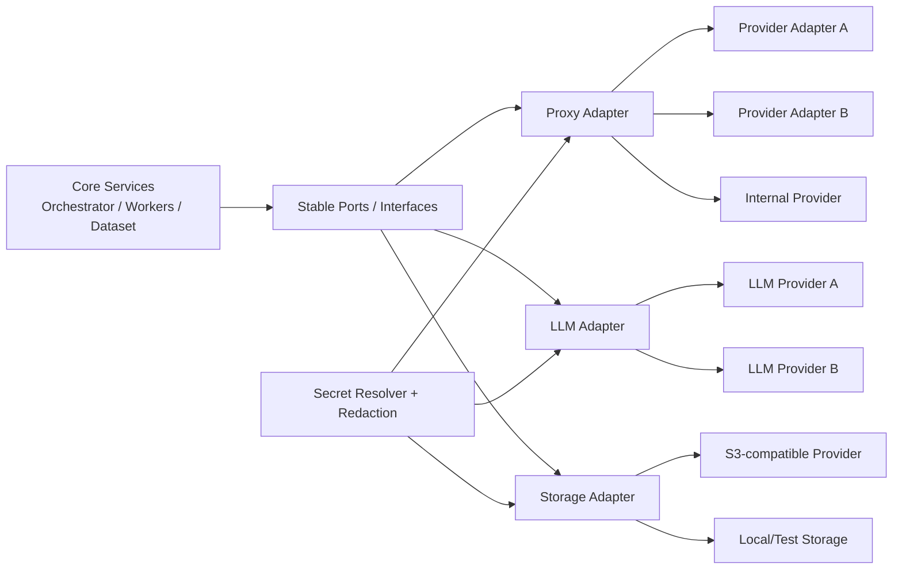
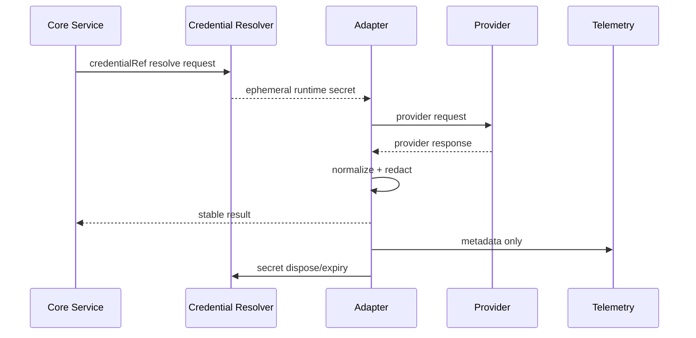

# Backend Phase 0 — P00-B17 Adapter Contracts

**Program:** Scraping Platform  
**Kapsam:** Yalnızca backend  
**Faz:** Phase 0 — Architecture & Specification  
**Task:** P00-B17 — ProxyProvider, LLMProvider ve Storage adapter contract'larını tanımla  
**Sürüm:** 1.0.0  
**Durum:** In Progress  
**Bağımlılık:** P00-B03 ve P00-B09 — Accepted  
**Owner:** Solution Architect

## 1. Amaç

Bu belge, dış servislerin backend core domain'den izole edilmesini sağlayan adapter sözleşmelerini tanımlar. Proxy, LLM ve object storage sağlayıcılarının API, SDK, credential, response, hata ve fiyat biçimleri core service'e sızmamalıdır.

Adapter'ın amacı yalnızca provider değiştirmek değildir. Aynı zamanda provider capability'lerini, health durumunu, maliyeti, rate/quota bilgisini, güvenli hata sınıfını ve versioned contract'ını ortak bir modele dönüştürmektir.

## 2. Adapter katman mimarisi



## 3. Ortak adapter ilkeleri

| İlke | Kural |
|---|---|
| Stable port | Core service yalnız normalize edilmiş interface'i bilir |
| Capability-driven | Provider'ın desteklemediği özellik runtime'da varsayılmaz |
| Secret isolation | Raw credential adapter sınırında resolve edilir; dışarı çıkmaz |
| Error normalization | Provider-specific error ortak stable code'a çevrilir |
| Deadline | Her adapter çağrısı timeout/deadline taşır |
| Idempotency | Acquire/release/write/LLM request tekrarında çift etki önlenir |
| Health | Health ve readiness core execution sonucundan ayrı ölçülür |
| Cost | Her billable çağrı usage event üretebilir |
| Versioning | Adapter contract versioned; provider adapter capability ile bildirir |
| Testability | Mock/fake adapter local ve CI'da gerçek credential olmadan çalışır |

## 4. Ortak tipler

### Provider descriptor

```json
{
  "providerId": "provider_01J...",
  "providerType": "PROXY",
  "adapterKey": "provider-adapter-key",
  "contractVersion": 1,
  "capabilities": {
    "geo": true,
    "stickySession": true,
    "bandwidthMeter": true,
    "browserCompatible": true
  },
  "status": "HEALTHY",
  "credentialRef": "credential_01J...",
  "pricingRef": "tariff_01J..."
}
```

### Adapter context

```json
{
  "tenantId": "tenant_01J...",
  "jobId": "job_01J...",
  "taskId": "task_01J...",
  "attemptId": "attempt_01J...",
  "traceId": "trace_01J...",
  "deadlineAt": "2026-08-26T10:00:31Z",
  "credentialRef": "credential_01J...",
  "policyDecisionRef": "policy_01J..."
}
```

Adapter context core'dan adapter'a geçer; raw secret değerini taşımaz. Adapter log ve result'ları bu context ile correlation eder.

## 5. ProxyProvider contract

### 5.1 Interface sorumluluğu

ProxyProvider; access request'i provider'a uygun biçime dönüştürür, bir lease veya normalized access plan alır, health/cost sonucu üretir ve release davranışını uygular. Core service provider'ın özel API endpoint'ini veya response payload'ını bilmez.

```ts
interface ProxyProvider {
  readonly id: string;
  readonly contractVersion: number;
  readonly capabilities: ProxyCapabilities;

  acquire(
    context: AdapterContext,
    request: ProxyRequest
  ): Promise<ProxyLeaseResult>;

  release(
    context: AdapterContext,
    lease: ProxyLease,
    result: LeaseResult
  ): Promise<ReleaseResult>;

  health(
    context: HealthContext,
    scope?: ProviderHealthScope
  ): Promise<ProviderHealth>;

  estimateCost(
    context: AdapterContext,
    request: ProxyRequest
  ): Promise<CostEstimate>;
}
```

### 5.2 ProxyRequest

```json
{
  "targetHost": "example.com",
  "scheme": "https",
  "country": "TR",
  "city": null,
  "asn": null,
  "proxyClass": "DATACENTER",
  "sessionMode": "EPHEMERAL",
  "stickySessionKeyRef": null,
  "maxDurationMs": 30000,
  "requiredCapabilities": ["https"],
  "policyDecisionRef": "policy_01J..."
}
```

### 5.3 Normalized ProxyLease

```json
{
  "leaseId": "lease_01J...",
  "providerId": "provider_01J...",
  "proxyClass": "DATACENTER",
  "country": "TR",
  "endpointRef": "endpoint_01J...",
  "connectionRef": "secret://runtime/proxy/lease_01J...",
  "sessionRef": null,
  "expiresAt": "2026-08-26T10:00:31Z",
  "usageMeterRef": "usage_01J..."
}
```

`connectionRef` raw proxy URL veya credential değildir; yalnız runtime resolver'ın erişebileceği süreli referanstır. Proxy lease core'a döndüğünde secret değerinin log/trace/API response'a sızmaması zorunludur.

### 5.4 Proxy capability modeli

| Capability | Anlam |
|---|---|
| `geo` | Ülke/şehir/ASN seçimi |
| `stickySession` | Session devamlılığı |
| `rotation` | Yeni endpoint/identity tahsisi |
| `bandwidthMeter` | Byte/GB kullanımı |
| `browserCompatible` | Browser runtime ile kullanılabilirlik |
| `http`, `https` | Scheme desteği |
| `healthProbe` | Scoped provider health |
| `costEstimate` | Çağrı öncesi tahmini maliyet |

Core strategy, capability olmadığı halde provider'a özellik parametresi gönderemez. Provider capability mismatch `PROVIDER_CAPABILITY_UNAVAILABLE` olarak normalize edilir.

## 6. LLMProvider contract

### 6.1 Interface

```ts
interface LLMProvider {
  readonly id: string;
  readonly contractVersion: number;
  readonly capabilities: LLMCapabilities;

  structuredExtract(
    context: AdapterContext,
    request: StructuredExtractRequest
  ): Promise<StructuredExtractResult>;

  estimateCost(
    context: AdapterContext,
    request: TokenEstimateRequest
  ): Promise<CostEstimate>;

  health(
    context: HealthContext
  ): Promise<ProviderHealth>;
}
```

### 6.2 StructuredExtractRequest

```json
{
  "modelRef": "model_01J...",
  "promptVersion": "extract-product-v3",
  "inputArtifactRef": "artifact_01J...",
  "schemaRef": "schema_01J...",
  "maxInputBytes": 200000,
  "maxOutputTokens": 1500,
  "temperaturePolicy": "deterministic",
  "responseFormat": "strict_json",
  "dataMinimization": {
    "removeScripts": true,
    "removeStyles": true,
    "redactSecrets": true
  }
}
```

### 6.3 StructuredExtractResult

```json
{
  "providerId": "llm_provider_01J...",
  "modelRef": "model_01J...",
  "resultStatus": "SUCCESS",
  "structuredDataRef": "artifact_01J...",
  "usage": {
    "inputTokens": 1200,
    "outputTokens": 380
  },
  "latencyMs": 842,
  "confidence": null,
  "promptVersion": "extract-product-v3"
}
```

LLM result doğrudan Dataset publish'e gitmez. Strict JSON parse, schema validation, field diagnostics ve quality policy tamamlanmadan sonuç candidate olarak kalır. Provider'a credential, cookie, authorization header veya gereksiz tenant verisi gönderilmez.

### 6.4 LLM capability modeli

| Capability | Anlam |
|---|---|
| `structuredOutput` | Strict JSON/schema output |
| `vision` | Görsel input |
| `maxInputBytes` | Input sınırı |
| `maxOutputTokens` | Output sınırı |
| `tokenMetering` | Input/output kullanım bilgisi |
| `regionPolicy` | Veri işleme bölgesi/tenant policy |
| `costEstimate` | Çağrı öncesi maliyet |

## 7. StorageProvider contract

### 7.1 Interface

```ts
interface StorageProvider {
  readonly id: string;
  readonly contractVersion: number;
  readonly capabilities: StorageCapabilities;

  put(
    context: AdapterContext,
    request: PutObjectRequest
  ): Promise<PutObjectResult>;

  get(
    context: AdapterContext,
    request: GetObjectRequest
  ): Promise<GetObjectResult>;

  delete(
    context: AdapterContext,
    request: DeleteObjectRequest
  ): Promise<DeleteObjectResult>;

  createScopedAccess(
    context: AdapterContext,
    request: ScopedAccessRequest
  ): Promise<ScopedAccessResult>;

  head(
    context: AdapterContext,
    request: HeadObjectRequest
  ): Promise<ObjectMetadata>;
}
```

### 7.2 Object write

```json
{
  "objectKeyRef": "tenant/tenant_01J/project/project_01J/job/job_01J/artifact/artifact_01J",
  "contentType": "application/json",
  "contentLength": 48320,
  "contentStreamRef": "runtime-stream",
  "expectedChecksum": "sha256:...",
  "retentionClass": "SHORT",
  "encryptionPolicy": "TENANT_MANAGED"
}
```

Storage adapter raw object body'yi loglamaz. Put sonucu object version, checksum, size, content type, URI reference ve availability status döndürür. Checksum uyuşmazlığı `STORAGE_CHECKSUM_MISMATCH` olarak normalize edilir.

### 7.3 Storage capability modeli

| Capability | Anlam |
|---|---|
| `streamingPut` | Büyük içerikte streaming write |
| `streamingGet` | Büyük içerikte streaming read |
| `versioning` | Object version |
| `presignedAccess` | Süreli scoped erişim |
| `encryptionAtRest` | At-rest encryption |
| `retentionLifecycle` | Storage lifecycle rule |
| `checksum` | Bütünlük doğrulaması |
| `deleteMarker` | Tombstone/deletion marker |

## 8. Normalize edilmiş adapter hata modeli

| Stable code | Category | Retryable varsayılanı | Açıklama |
|---|---|:---:|---|
| `ADAPTER_TIMEOUT` | DEPENDENCY | Evet | Adapter deadline aşıldı |
| `ADAPTER_UNAVAILABLE` | DEPENDENCY | Evet | Provider bağlantısı/health yok |
| `PROVIDER_AUTH_FAILED` | AUTH | Hayır | Credential geçersiz/expired |
| `PROVIDER_RATE_LIMITED` | RATE | Evet | Provider rate/quota |
| `PROVIDER_CAPABILITY_UNAVAILABLE` | VALIDATION | Hayır | İstenen capability yok |
| `PROVIDER_POLICY_DENIED` | POLICY | Hayır | Provider/tenant policy reddi |
| `PROVIDER_INVALID_RESPONSE` | DATA | Sınırlı | Response normalize edilemedi |
| `PROVIDER_QUOTA_EXCEEDED` | BUDGET | Hayır | Kota/budget tükendi |
| `STORAGE_CHECKSUM_MISMATCH` | DATA | Sınırlı | Yazılan içerik beklenenle farklı |
| `STORAGE_OBJECT_NOT_FOUND` | DATA | Hayır | Object yok |
| `LLM_INVALID_STRUCTURED_OUTPUT` | DATA | Sınırlı | Strict JSON/schema output geçersiz |
| `LLM_CONTENT_POLICY_REJECTED` | POLICY | Hayır | Provider policy reddi |
| `LLM_BUDGET_EXCEEDED` | BUDGET | Hayır | Token veya maliyet bütçesi |
| `ADAPTER_CONFIGURATION_ERROR` | CONFIG | Hayır | Adapter config eksik/geçersiz |

Adapter error result; provider raw error body yerine stable code, safe reason, provider ID, contract version, retryable ve correlation taşır.

## 9. Secret ve credential akışı



Credential resolver raw secret'i yalnız gerekli çağrı scope'unda sağlar. Adapter result, exception veya telemetry raw secret taşımaz. Provider credential rotation, adapter health ve revoke davranışı ilgili security policy'ye bağlanır.

## 10. Contract versioning

Her adapter `contractVersion` ve `capabilities` bildirir. Breaking interface değişikliği yeni major version ister. Provider-specific optional capability eklemek mevcut core contract'ı bozmaz; capability matrix ile bildirilebilir. Adapter registry aynı provider için birden fazla version barındırabilir; yeni version certification olmadan production'a alınamaz.

## 11. Test matrisi

| Test | Proxy | LLM | Storage | Beklenen kanıt |
|---|:---:|:---:|:---:|---|
| Interface contract | Evet | Evet | Evet | Ortak input/output/error testleri |
| Mock/fake | Evet | Evet | Evet | Local/CI gerçek secret olmadan |
| Timeout/cancel | Evet | Evet | Evet | Deadline ve cancellation sonucu |
| Auth/credential failure | Evet | Evet | Evet | Raw secret yok, stable error |
| Rate/quota | Evet | Evet | Opsiyonel | Retry/budget davranışı |
| Capability mismatch | Evet | Evet | Evet | Stable capability error |
| Idempotency | Lease/release | Request reference | Put/delete | Duplicate etki yok |
| Health degradation | Evet | Evet | Evet | Health state ve alarm |
| Cost metering | Evet | Evet | Evet | Usage event ve tariff ref |
| Redaction | Evet | Evet | Evet | Log/trace/exception scan |
| Contract version | Evet | Evet | Evet | Backward compatibility |
| Failure injection | Evet | Evet | Evet | Failover/recovery evidence |

## 12. Adapter onboarding checklist

Yeni adapter için aşağıdaki kanıtlar olmadan enable edilmez:

1. Provider descriptor, contract version ve capability matrix.
2. Secret reference, rotation, revoke ve access audit davranışı.
3. Normalized success/result/error mapping.
4. Timeout, cancellation, rate/quota ve retry davranışı.
5. Health probe ve degraded/quarantine davranışı.
6. Usage event ve pricing/tariff mapping.
7. Mock/fake, contract, integration ve failure injection testleri.
8. Tenant/policy/egress ve redaction kontrolleri.
9. Operational runbook, owner ve escalation bilgisi.
10. Security/FinOps/SRE/QA certification sign-off.

## 13. P00-B17 kabul kriterleri

P00-B17 `Accepted` sayılması için:

1. ProxyProvider, LLMProvider ve StorageProvider interface'leri ve normalize edilmiş modeller tanımlıdır.
2. Capability, provider descriptor, adapter context ve contract versioning kuralları vardır.
3. Proxy lease, structured extraction ve storage object akışları güvenli reference kullanır.
4. Provider-specific error'lar stable error taxonomy'ye çevrilmiştir.
5. Secret/credential çözümleme ve redaction akışı yazılıdır.
6. Idempotency, deadline, cancellation, health, quota, cost ve failure injection gereksinimleri tanımlıdır.
7. Yeni adapter onboarding ve certification checklist'i hazırdır.
8. Proxy, LLM ve Storage adapter'ları core service'e coupling oluşturmadan değiştirilebilir durumdadır.
9. Solution Architect, Backend, SRE, Security, FinOps ve QA review'ü tamamlanmıştır.

## References

[1]: ../../source/pasted_content.txt "Kullanıcı tarafından sağlanan sistem taslağı"
[2]: ../01-architecture.md "Platform mimarisi ve bileşen tasarımı"
[3]: ../07-security-rbac.md "Güvenlik, RBAC ve tenant izolasyonu"
[4]: ../08-observability-cost.md "Gözlemlenebilirlik ve maliyet"
[5]: phase-0-m0-backend-baseline.md "Backend M0 baseline"
[6]: phase-0-m0-execution-domain.md "Extended execution domain"
[7]: phase-0-m0-security-controls.md "Security control matrix"
[8]: phase-0-m0-cost-model.md "Cost model"
