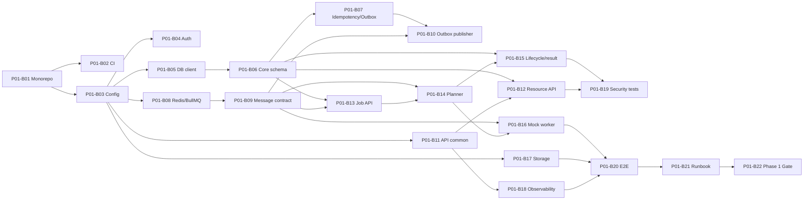

# Backend Phase 0 — P00-B18 Phase 1 Handover

**Program:** Scraping Platform  
**Kapsam:** Yalnızca backend  
**Faz:** Phase 0 — Architecture & Specification  
**Task:** P00-B18 — Phase 1 Core Platform backend başlangıç backlog'u ve dependency handover'ı  
**Sürüm:** 1.0.0  
**Durum:** In Progress  
**Bağımlılık:** P00-B05, P00-B07 ve P00-B09 — Accepted  
**Owner:** Engineering Manager

## 1. Handover amacı

Bu belge, M0 Architecture Baseline sonrasında Phase 1 — Core Platform backend geliştirmesine geçiş için uygulanabilir başlangıç planıdır. Phase 1'de ilk çalışan backend MVP'si oluşturulur; HTTP veya browser scraping yeteneklerinin tamamı değil, API → queue → orchestrator → mock worker → database/storage temel akışı doğrulanır.

Phase 1 handover, M0'da kabul edilen domain, API, queue, lifecycle, security, observability, cost ve adapter sözleşmelerini implementation task'larına dönüştürür. Frontend implementasyonu bu handover'ın kapsamı dışındadır.

## 2. Phase 1 hedefi

Phase 1 sonunda sistem aşağıdaki akışı güvenli ve tekrarlanabilir biçimde çalıştırabilmelidir:

```text
Authenticated API Client
  → POST /api/v1/projects
  → POST /api/v1/targets
  → POST /api/v1/schemas
  → POST /api/v1/jobs
  → PostgreSQL Job/Run/Task
  → Outbox
  → Redis/BullMQ
  → Mock Worker
  → Task Result
  → Orchestrator State Transition
  → Artifact/Result Storage
  → GET /api/v1/jobs/{jobId}
```

Phase 1 tamamlandığında gerçek scraping motorunun bütün özellikleri hazır olmak zorunda değildir. Ancak gerçek HTTP/Browser Worker'ların daha sonra aynı queue, attempt, artifact, error ve lifecycle sözleşmesine takılabilmesi zorunludur.

## 3. Phase 1 başlangıç task listesi

| ID | İş paketi | Task | Owner | Efor (pd) | Bağımlılık | Öncelik | Kabul kriteri |
|---|---|---|---|---:|---|---|---|
| P01-B01 | Repository | Backend monorepo ve workspace yapısını kur | Engineering Manager | 2 | M0 gate | P0 | `apps`, `workers`, `packages`, `infra`, `docs` yapısı build edilebilir |
| P01-B02 | CI | Lint, typecheck, unit test, build ve dependency scan pipeline'ını kur | SRE/Platform Lead | 3 | P01-B01 | P0 | Temiz checkout CI kalite kapılarından geçer |
| P01-B03 | Config | Validated config schema ve environment ayrımını kur | SRE/Platform Lead | 3 | P01-B01 | P0 | Eksik/geçersiz config startup'ta reddedilir; secret placeholder çalışır |
| P01-B04 | Auth | Provider-agnostic auth context ve test identity adapter'ı oluştur | Backend Lead | 4 | P00-B12 | P0 | Actor, tenant, role ve scope API context'e taşınır |
| P01-B05 | Database | PostgreSQL client, migration ve connection health'i kur | Backend Lead | 3 | P01-B03 | P0 | Migration tekrarlanabilir; pool/timeout/health çalışır |
| P01-B06 | Database | Tenant, Project, Target, Schema, Job, Run, Task, Attempt tablolarını oluştur | Backend Lead | 8 | P01-B05, P00-B05 | P0 | Foreign key, tenant scope, status, unique/index baseline uygulanır |
| P01-B07 | Database | Idempotency, outbox, audit ve usage event tablolarını oluştur | Backend Lead | 6 | P01-B06, P00-B08, P00-B16 | P0 | Unique key ve append-only/derived metadata kuralları testlidir |
| P01-B08 | Queue | Redis connection, queue prefix, producer/consumer helper'larını kur | Backend Lead | 4 | P01-B03, P00-B09 | P0 | Authenticated Redis/BullMQ bağlantısı ve health çalışır |
| P01-B09 | Queue | Message envelope, schema validation ve queue routing'i uygula | Backend Lead | 5 | P01-B08, P00-B09 | P0 | Command/result/event message'ları version ve correlation taşır |
| P01-B10 | Queue | Outbox publisher ve publish retry/reconcile mekanizmasını kur | SRE/Platform Lead | 6 | P01-B07, P01-B09 | P0 | DB commit + outbox sonrası queue publish kaybı reconcile edilir |
| P01-B11 | API | Common middleware: requestId, trace context, error mapping ve pagination | Backend Lead | 5 | P01-B03, P00-B07, P00-B15 | P0 | Ortak response/error envelope ve correlation alanları çalışır |
| P01-B12 | API | Project, Target ve Schema resource endpoint'lerini geliştir | Backend Lead | 8 | P01-B06, P01-B11 | P0 | CRUD, tenant/RBAC/policy validation ve safe response çalışır |
| P01-B13 | API | Job create/detail/cancel/retry endpoint'lerini geliştir | Backend Lead | 8 | P01-B06, P01-B09, P01-B11 | P0 | Job create `202`; command idempotent; detail status döner |
| P01-B14 | Orchestrator | Job command consumer ve initial task planner'ı geliştir | Backend Lead | 8 | P01-B09, P01-B13 | P0 | Valid Job için Task/Attempt ve execution command oluşturulur |
| P01-B15 | Orchestrator | Lifecycle transition, optimistic lock ve result consumer'ı geliştir | Backend Lead | 8 | P01-B06, P00-B10 | P0 | Geçersiz transition ve duplicate result engellenir |
| P01-B16 | Worker | Mock worker handler ve lease/heartbeat akışını oluştur | Backend Lead | 6 | P01-B09, P01-B14 | P0 | Task claim, heartbeat, success/failure ve lease expiry simüle edilir |
| P01-B17 | Storage | S3-compatible/local test storage adapter ve artifact metadata'yı kur | SRE/Platform Lead | 5 | P01-B03, P00-B17 | P0 | Artifact upload/checksum/head ve scoped reference çalışır |
| P01-B18 | Observability | Common structured logger, metric helper ve trace exporter'ı bağla | SRE/Platform Lead | 5 | P01-B11, P00-B15 | P0 | API→queue→worker trace/correlation zinciri görünür |
| P01-B19 | Security | Tenant negative test, secret redaction ve SSRF policy unit test'lerini ekle | Security Lead | 6 | P01-B04, P01-B12, P01-B16 | P0 | Cross-tenant, raw secret ve private target senaryoları reddedilir |
| P01-B20 | QA | API/queue/orchestrator/mock worker/storage E2E smoke suite | QA Lead | 8 | P01-B10, P01-B15, P01-B17, P01-B18 | P0 | Temel uçtan uca akış CI'da tekrarlanabilir çalışır |
| P01-B21 | Operations | Local/staging runbook, health/readiness ve rollback planı | SRE/Platform Lead | 4 | P01-B18, P01-B20 | P0 | Geliştirici ve operasyon ekibi stack'i çalıştırıp durdurabilir |
| P01-B22 | Gate | Phase 1 Core Platform MVP gate review | Engineering Manager | 2 | P01-B20, P01-B21 | P0 | API→queue→worker→DB/storage flow kabul edilmiş; blocker yok |

## 4. Bağımlılık grafiği



## 5. İlk sprint önerisi

İlk sprint, gerçek scraping yeteneği geliştirmeden backend platform temelini kurmalıdır:

| Sprint task | Amaç | Çıkış kriteri |
|---|---|---|
| P01-B01 | Monorepo/workspace | Package boundaries ve build scriptleri hazır |
| P01-B02 | CI | Lint/typecheck/test/build pipeline hazır |
| P01-B03 | Config | Config schema ve local/staging separation hazır |
| P01-B05 | DB client | PostgreSQL bağlantısı, migration runner ve health hazır |
| P01-B06 | Core schema | Tenant/project/target/schema/job/task/attempt tabloları hazır |
| P01-B08 | Redis/BullMQ | Queue connection ve basic producer/consumer hazır |
| P01-B11 | API common | Health, requestId, error envelope ve auth context hazır |

İlk sprint'in demonstrasyonu; authenticated test identity ile bir Project, Target ve Schema oluşturup database'e yazabilmek ve queue health bilgisini API'den görebilmektir.

## 6. Phase 1 kalite kapıları

| Gate | Minimum kanıt |
|---|---|
| Repository/CI | Temiz checkout build, lint, typecheck, unit test ve dependency scan |
| Database | Migration, tenant FK, unique/index, rollback/forward compatibility |
| Queue | Envelope, schema validation, routing, outbox, retry ve DLQ smoke |
| API | Auth context, RBAC, safe error, pagination, idempotency ve resource CRUD |
| Orchestrator | Job/task/attempt create, dispatch, result, state transition, duplicate guard |
| Worker | Lease, heartbeat, mock success/failure, timeout/worker loss |
| Storage | Artifact write, checksum, metadata ve scoped access |
| Security | Cross-tenant, secret redaction, SSRF/egress negative tests |
| Observability | request/trace/job/task/attempt correlation, structured logs ve temel metrics |
| Operations | Health/readiness, local/staging runbook, rollback ve incident notes |

## 7. Phase 1 non-goals

Phase 1'de gerçek crawling, gelişmiş browser action, provider intelligence, AI strategy, mobile/residential proxy, marketplace ve kapsamlı Control Center implementasyonu yapılmaz. Mock worker, gerçek worker contract'ını doğrulamak için kullanılır; production scraping capability'sinin yerine geçmez.

## 8. Handover riskleri

| Risk | Etki | Önlem |
|---|---|---|
| Auth provider seçiminin gecikmesi | API implementation blocker | Provider-agnostic test identity ile başla; provider seçimini adapter sınırında tut |
| Outbox kararının gecikmesi | Queue publish kaybı | PostgreSQL outbox baseline'ını default kabul et; ADR ile değiştirilebilir yap |
| Migration/domain uyumsuzluğu | Veri bütünlüğü riski | P00-B05 model ve invariant'ları migration review'e bağla |
| Queue payload büyümesi | Memory/latency sorunu | Büyük içerik artifact reference olarak tutulur |
| Security testlerinin sona bırakılması | Rework ve release riski | P01-B19'u core E2E'den önce CI'ya al |
| Scope creep | Phase 1 gecikmesi | Browser/crawler/AI özelliklerini Phase 2+ backlog'unda tut |

## 9. P00-B18 kabul kriterleri

P00-B18 `Accepted` sayılması için:

1. Phase 1 Core Platform hedef akışı ve non-goals yazılıdır.
2. 22 backend başlangıç task'ı owner, effort, dependency, priority ve acceptance criteria ile tanımlıdır.
3. Monorepo, config, database, queue, API, orchestrator, mock worker, storage, observability, security, QA ve operations iş paketleri kapsanmıştır.
4. Task bağımlılık grafiği ve ilk sprint önerisi mevcuttur.
5. Phase 1 exit gate ve test kanıtları belirlenmiştir.
6. Auth, outbox, migration, queue payload ve security gibi handover riskleri kayıtlıdır.
7. Engineering Manager, Backend Lead, SRE, Security, QA ve Product review'ü tamamlanmıştır.

## References

[1]: ../../source/pasted_content.txt "Kullanıcı tarafından sağlanan sistem taslağı"
[2]: phase-0-m0-backend-baseline.md "Backend M0 baseline"
[3]: phase-0-m0-backend-architecture.md "Backend architecture"
[4]: phase-0-m0-core-domain.md "Core domain model"
[5]: phase-0-m0-api-contract.md "Backend API contract"
[6]: phase-0-m0-queue-contract.md "Queue contract"
[7]: phase-0-m0-lifecycle-contract.md "Lifecycle contract"
[8]: phase-0-m0-security-controls.md "Security control matrix"
[9]: phase-0-m0-observability-standard.md "Observability standardı"
[10]: phase-0-m0-cost-model.md "Cost model"
